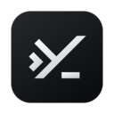
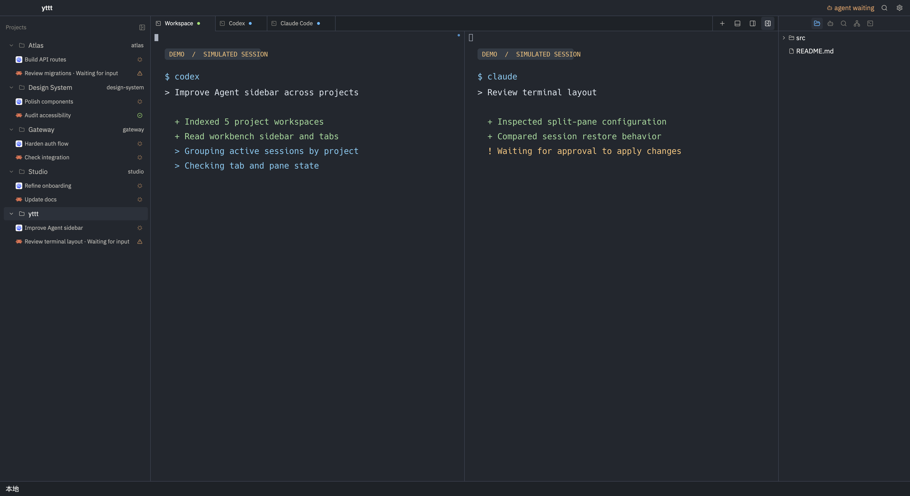

<h1 align="center">
   yttt
</h1>

<p align="center">macOS · Windows · Linux</p>

<p align="center"><sub><a href="README.zh-CN.md">中文</a> · <a href="README.md">English</a></sub></p>

<p align="center">
  <strong>A project-first, terminal-first workbench for CLI agents.</strong><br>
  Keep projects, terminals, files, and Agent sessions together.
</p>

<h3 align="center"><a href="https://github.com/yuWorm/yttt/releases">Download yttt</a></h3>

<p align="center">
  
</p>
<p align="center"><sub>Maximized app capture. Projects and Agent states are simulated; terminal text is composited demo content. No Agent CLI was launched.</sub></p>

## Features

<table>
<tr>
<td width="50%" valign="top">
<h3>Projects &amp; Agents</h3>
<p>Switch projects without losing each project's tabs, layout, or Agent status.</p>
<a href="docs/usage.md#product-model">Guide →</a>
</td>
<td width="50%" valign="top">
<h3>Split Terminals</h3>
<p>Split terminals inside tabs and keep multiple CLI workflows in view.</p>
<a href="docs/usage.md#first-launch">Guide →</a>
</td>
</tr>
<tr>
<td width="50%" valign="top">
<h3>Files &amp; Editor</h3>
<p>Browse project files, edit text, and preview images alongside terminals.</p>
<a href="docs/usage.md#project-files-and-editor">Guide →</a>
</td>
<td width="50%" valign="top">
<h3>Local &amp; Remote Workspaces</h3>
<p>Connect to an existing desktop Host or open projects through SSH, with resources owned by their Host.</p>
<a href="docs/usage.md#connect-to-an-existing-desktop-host">Desktop Host →</a> · <a href="docs/usage.md#ssh-projects">SSH →</a>
</td>
</tr>
<tr>
<td width="50%" valign="top">
<h3>Keys &amp; Appearance</h3>
<p>Customize shortcuts, Global Vim, themes, and bars without mixing device and Host settings.</p>
<a href="docs/usage.md#keybindings">Keybindings →</a> · <a href="docs/usage.md#configuration-targets">Settings →</a>
</td>
<td width="50%" valign="top">
<h3>Desktop CLI</h3>
<p>Use <code>yttt ctl</code> to inspect projects and Agent status, and manage tabs, panes, and terminal input.</p>
<a href="docs/cli-control.md">CLI guide →</a>
</td>
</tr>
</table>

## Agent workflows

Run the CLI agents you already use in terminal panes. yttt can show supported Agent lifecycle
status in the project sidebar; a terminal command and an Agent-status integration are distinct.
See [Agent status](docs/usage.md#agent-status).

## Download

Get the desktop package for your platform from [GitHub Releases](https://github.com/yuWorm/yttt/releases):

- **macOS Apple Silicon:** download the `.dmg` and drag yttt to Applications.
- **Windows x86_64:** run the `.exe` installer.
- **Linux x86_64:** extract the `.tar.gz` and run `bin/yttt` inside it.

Check the supplied SHA-256 sums. macOS packages are ad-hoc signed, not notarized.
Keep desktop, Host, and remote Server on matching versions.

<details>
<summary>Upgrading from the old 1.0.0 release</summary>

Development returned to pre-1.0 versioning after v1.0.0. Install a newer pre-1.0 release manually;
a SemVer-based updater will not treat it as an upgrade from 1.0.0.

</details>

## Get started

Open the app, choose a language and terminal font, then open a local project. Add terminal or
Agent tabs, split a tab into panes, and open project files from the right-hand tree. For remote
access and session restoration, follow the [usage guide](docs/usage.md).

To drive an already-running desktop from a script, start with `yttt ctl --help` or the
[CLI examples](docs/cli-control.md).

## Documentation

- [Usage guide](docs/usage.md) — UI, remote access, session restoration, and settings.
- [CLI control](docs/cli-control.md) — desktop commands and examples.
- [Host/Client architecture](docs/host-client-architecture.md) — process and resource ownership.
- [Changelog](CHANGELOG.md) — releases and upgrade notes (English and Chinese).

## Develop

Build and launch from source with Rust:

```bash
cargo run
cargo run -- /path/to/project
```

On macOS, `scripts/run-dev-app.sh` creates a development `.app` bundle for GPUI UI checks.
Use `scripts/run-dev-app.sh --fixture readme` to open five **simulated** projects for the
screenshot above; it does not launch Agent CLIs.

<details>
<summary>Release maintenance</summary>

Build packages on their native platforms with `scripts/build-macos-dmg.sh`,
`scripts/build-windows-installer.ps1`, and `scripts/build-linux-tar.sh`. Prepare a release
with `python3 scripts/prepare_release.py <version>` (or `--repair-current` when repairing
an existing version section), then run `python3 scripts/test_release_tools.py`.
Review the manifest, lockfile, changelog, and README before tagging; wait for the required
validation workflow on the release commit. The tag workflow validates that exact tag before
building and publishing packages, Server binaries, update metadata, and checksums.

</details>
