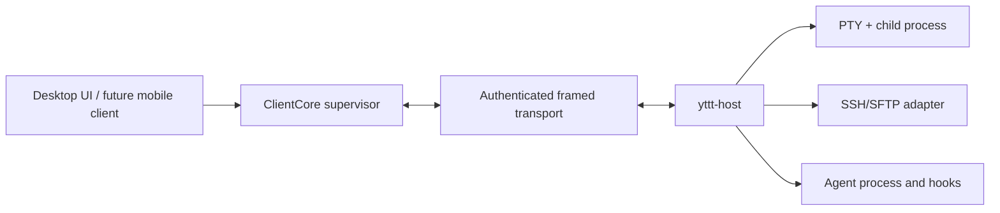

# yttt Host/Client 架构规范

- 状态：Phase 1 本地 IPC 完整实现
- 更新：2026-08-18
- 适用协议：`yttt-protocol` 资源/lifecycle/desktop-shell v2；帧头 v1
- 相关设计：[`p2p-relay-architecture.md`](./p2p-relay-architecture.md)

本文定义 yttt 的标准 Host/Client 边界、资源所有权、终端同步协议、本地安全模型、生命周期和恢复语义。P2P、Relay、移动端等连接路径只能扩展本规范，不能改变资源所有权。

## 1. 不变量

1. Host 是长生命周期执行资源的权威节点；UI Client 只持有镜像和呈现状态。
2. 默认桌面 Host 由 desktop shell 的 authenticated owner channel 持有；关闭窗口不释放 owner，desktop shell 退出或连接消失必须 ForceStop Host 及其资源。
3. 只有显式启动的独立后台 Host 可在 Desktop Client 退出后继续运行；`--start-host` 与登录启动使用该模式。
4. 每个 profile 最多一个 Host；不同 profile、开发实例和测试实例使用不同 runtime root，不能串线。
5. 终端网格只在 Host 解析一次。Client 接收语义快照/增量，不重新解析原始 PTY 字节。
6. 一个终端同时只有一个 Interactive lease；Observer 可以只读附加。
7. 输入、尺寸、资源 revision、session epoch 和事件 sequence 都必须单调校验。
8. 慢 Client 不能阻塞 PTY reader、其他 Client 或 Host 资源循环。
9. 本地 IPC 仍须验证操作系统用户、endpoint 权限、profile、build 和一次性认证材料；“仅本机”不等于“可信”。
10. Wire 协议不序列化 Rust 进程内对象、GPUI Entity、PTY handle 或 SSH channel。

## 2. 部署拓扑



标准桌面部署包含两个 OS 进程：

- Desktop Client：GPUI window、focus、theme、render cache、编辑器呈现、命令面板和 `ClientCore`。
- `yttt-host`：PTY/child、终端 VTE 状态、scrollback、checkpoint、lease、资源目录和进程退出状态。

本地传输：

- Unix：profile runtime root 下的 Unix domain socket，目录权限 `0700`，socket 权限 `0600`，并验证 peer UID。
- Windows：拒绝远程客户端的 named pipe，DACL 仅允许 SYSTEM 和 owner。
- Wire：16-byte header、固定 magic/version/kind/length、最大 frame 8 MiB；header 在分配 payload 前验证。结构化控制消息使用带字段名的 CBOR；演进规则见 [`wire-evolution.md`](./wire-evolution.md)。

未来 P2P、Relay 或直接网络连接替换的只是 `IPC` 边，不得把 PTY、文件系统或 Agent 状态移回 Client。

## 3. crate 与责任边界

| 组件 | 责任 | 禁止持有 |
|---|---|---|
| `yttt-protocol` | ID、handshake 后 request/response/event、terminal snapshot/delta、SSH/file/git/agent wire DTO | socket、PTY、GPUI 类型、平台 handle |
| `yttt-transport` | 可靠双向 stream 抽象、framing、handshake、in-process 内存传输 | 具体 IPC/网络实现、Host 资源策略、UI 状态 |
| `yttt-transport-local` | Unix socket/named pipe endpoint、peer/permission 检查 | Host 资源策略、UI 状态、应用协议 |
| `yttt-host` | 资源目录、terminal runtime、lease、checkpoint、退出确认、drain | GPUI Entity、window/focus/theme、具体传输类型 |
| `yttt-client-core` | 连接 supervisor、请求关联、事件订阅、terminal mirror、重连对账 | PTY child、权威 scrollback、具体传输类型 |
| `yttt-terminal` | Host 侧 VTE/语义快照能力与 Client 侧 semantic render/input adapter | profile/Host 生命周期 |
| Desktop app | Host launch/attach、window lifecycle、Client mirror 到 `TerminalView` 的适配 | 长生命周期 PTY 所有权 |

依赖方向保持为：

```text
              yttt-protocol
                    ^
                    |
              yttt-transport
               ^          ^
               |          |
     yttt-client-core   yttt-host
               ^          ^
               |          |
        yttt-transport-local
                    ^
                    |
                 desktop
```

`yttt-host` 与 `yttt-client-core` 只依赖 `yttt-transport` 抽象；`yttt-transport-local` 是 desktop 与测试使用的本地 IPC 实现。

`yttt-host` 与 `yttt-client-core` 不能依赖 Desktop UI。

## 4. 身份、认证与 profile 隔离

### 4.1 Host 身份

Host handshake 返回：

- `ProtocolRange`
- `build_id`
- `profile_id`
- `host_id`
- `host_epoch`

`host_epoch` 每次 Host 进程启动递增。Client 的 session epoch、sequence 或 lease 不能跨 Host epoch 静默复用。

### 4.2 Client 身份

Client handshake 提交：

- 支持的协议区间
- `build_id`
- `profile_id`
- `client_instance_id`
- 已知 `host_epoch`（重连时）

连接必须同时满足协议相交、build/profile 匹配、OS peer 属于当前用户和认证 token 匹配。失败必须在建立资源访问能力前终止连接。

### 4.3 runtime root

每个 `AppProfile` 派生独立路径：

- endpoint
- `host.lock`
- `host.pid`
- `host-ready.json`
- `host-epoch`
- `auth-token`

开发 fixture 和测试必须使用隔离的临时 runtime root。不得扫描或回退到其他 profile 的 endpoint。

认证 token 文件在 Unix 上必须是普通文件、owner 正确且权限 `0600`；内存中的 token 在 drop 时清零。任何日志和 `Debug` 输出都不得包含 token 或 credential 明文。

## 5. 协议会话

### 5.1 帧

每帧包含 `magic`, `protocol_version`, `frame_kind`, `payload_len`。允许的 kind 仅为 handshake、request/response control 和 server event。解码顺序：

1. 读取固定 header。
2. 校验 magic、version、kind。
3. 检查 `payload_len <= 8 MiB`。
4. 分配并读取 payload。
5. 按 kind 反序列化。

任何边界失败都关闭该连接，不能影响其他 Client 或 Host 资源。

### 5.2 request/response

Client 为每个 request 分配单调 `request_id`。Host 原样回传该 ID。`ClientCore` 的 pending map 只在收到匹配 response 后完成请求；断线时所有未完成用户请求返回 `NotConnected`，不会假定执行成功并自动重放。

这是 at-most-once Client 语义。调用方若在断线后重试有副作用操作，必须携带资源 ID、epoch/revision 或幂等键。

`TerminalInput` 仍在同一 control stream 上分配 `request_id`、保持与 resize/scroll 的顺序并由
Host 返回 response，但 Desktop 快速路径不再为每次按键创建 oneshot waiter 和 Tokio task。
`ClientCore` 只在 pending map 中保留轻量 completion 类型；control writer 是有界单消费者，
response completion 只消费确认/记录协议失败，不与 terminal data decode、mirror merge 或
GPUI foreground executor 争用执行槽。队列 admission/backpressure 在写入时同步返回。

### 5.3 server event

Host event 具有：

- `host_epoch`
- `host_sequence`
- event body

Client 必须按 epoch/sequence 处理，旧 epoch 或倒退事件不能覆盖新状态。终端自身另有 `session_epoch` 和 terminal `sequence`。

终端 data channel 是例外：`ClientCore` 在独立 data worker 中把 snapshot/delta 原位合并到
terminal mirror，只发布 `Arc<TerminalStreamUpdate>`；不得复制完整 `SemanticViewport`，
也不得把同一 terminal frame 作为通用 `ClientEvent::Server` 重复广播。Desktop 对每个
terminal 使用有界 update stream；viewport receiver 在 background executor 中原位应用
delta，再通过终端已有的 bounded/coalescing redraw mailbox 唤醒 GPUI。prepaint 仅转换
damage row，未变化 row 的 render generation、text shaping 与 line identity 保持不变。
title/process-state 与 lease/exit 等控制事件在 Host runtime worker 中按 `session_id` 过滤后
才进入 GPUI，避免 continuously-ready 的 viewport 或无关事件消费者占用前台 executor。

## 6. 资源目录

`ListResources` 返回 `ResourceCatalog`：

- profile / Host identity
- catalog revision
- terminal placements
- SSH connection IDs

Terminal placement 包含稳定 `project_id`、`session_id`、几何、owner、最后 sequence 和可选 viewport。`tab_id` / `pane_id` 只属于客户端布局，不进入 Host catalog 或 `address_fingerprint`。

`AgentSnapshotUpdate.terminal_session_id` 是 Agent 状态关联当前客户端布局的唯一资源键。Client 必须先用它找到当前 terminal pane，再取得本地 `project_id/tab_id/pane_id`；Hook scope 中的 `tab_id` / `pane_id` 不是客户端布局键。若 pane 尚未恢复，Client 保留该 session 的最新 snapshot，待 placement 出现后再应用。

连接成功或重连成功后，`ClientCore` 第一项内部请求必须是 `ListResources`：

1. catalog 中存在且带 viewport：立即替换镜像。
2. catalog 中存在但不带 viewport：请求 checkpoint；旧镜像可暂时显示。
3. Client cache 中存在但 catalog 不存在：删除镜像并发布 `TerminalUnavailable`。
4. UI 收到当前 pane 的 `TerminalUnavailable`：结束旧 generation；若 pane 配置为 AutoRestart，则以新 session generation 重建。

对账完成前，旧 checkpoint 只是一份可见缓存，不是资源仍存活的证据。

## 7. 终端资源模型

### 7.1 创建

`SpawnTerminal` 必须携带完整、可序列化的 `TerminalSpawnSpec`：

- stable IDs
- cwd
- shell/command execution descriptor
- rows/cols/cell dimensions
- geometry epoch
- scrollback limit
- environment 与 removed-environment

Host 创建 PTY、spawn child、关闭 slave 副本，然后创建：

- PTY reader worker
- PTY writer queue/worker
- terminal event processor
- child monitor
- `alacritty_terminal::Term`
- bounded raw replay ring（8 MiB）
- semantic snapshotter

Client 不接收 PTY fd/handle。

### 7.2 输出路径

```text
child -> PTY master -> Host reader
      -> VTE parser -> authoritative Term
      -> SemanticSnapshotter
      -> snapshot or delta event
      -> ClientCore TerminalMirror
      -> TerminalView semantic viewport
      -> GPUI prepaint/render cache
```

Host 每次捕获生成完整 semantic viewport，再按上一序列构造 delta。delta 至少覆盖：

- changed rows/spans/style/hyperlink
- cursor
- modes/title/cwd
- palette revision
- process state
- geometry/scrollback epoch

Client 仅接受 `base_sequence == mirror.sequence` 的 delta；检测到 gap、epoch 变化或 `ResyncRequired` 后请求 checkpoint。

Client 的 `TerminalView::new_semantic` 只启动一个 input writer worker；它不创建空转的 PTY reader/parser，也不分配本地 PTY read-buffer pool。这样 Host 化不会在 Client 重复 VTE 解析或额外保留两条空转线程。

### 7.3 输入、resize 与 scroll

- `TerminalInput`：`client_sequence` 必须单调；Host 在写 PTY 前验证 Interactive lease。
- `ResizeTerminal`：`geometry_epoch` 必须递增；旧 resize 被拒绝。
- `ScrollTerminal`：请求绝对 `display_offset`；Host 将其转换为当前 authoritative grid 的受限 delta，并返回实际 offset。
- palette query：Client 发送当前可见主题 RGB 和 revision，Host 才能正确回答 OSC color query。

UI 不得在 GPUI 线程等待 Host response。输入经有界 writer queue；resize/scroll 发出异步请求。

### 7.4 lease

- `Interactive`：可输入、resize、scroll；每个 terminal 唯一 owner。
- `Observer`：只读附加。
- acquire 新 Interactive lease 时，Host 撤销旧 lease，并向旧 owner 发送 `TerminalLeaseRevoked`。
- Client 断线只释放该 Client 的 lease，不终止 terminal。

### 7.5 退出

PTY child 退出后：

1. Host drain PTY 尾部、记录 `Exited { code }` 并发布带 final sequence 的最后 viewport。
2. Host 发送 `TerminalExit { session_id, session_epoch, code, final_sequence }`。
3. 资源及 final checkpoint 保持可查询，直到 owner 发送 `AcknowledgeTerminalExit` 或 10 分钟 TTL 到期。
4. acknowledgement 同时匹配 session epoch 和 final sequence 后，Host 才从 catalog 删除 terminal。

重复/旧 generation 的退出回调不得关闭新建 pane。

## 8. 背压与资源上限

固定边界：

| 边界 | 上限 |
|---|---:|
| wire frame | 8 MiB |
| Host terminal raw replay | 8 MiB / subscribed terminal；256 KiB / unsubscribed terminal |
| Host terminal writer queue | 1024 commands |
| Host terminal internal event queue | 256 events |
| Host terminal subscriber channel | 64 events / subscriber |
| Client command queue | 256 requests |
| Client event broadcast | 256 events |
| request timeout | 10 s |
| initial connect timeout | 10 s |

策略：

- PTY raw replay 达到当前订阅容量时丢弃最旧字节并累计 `dropped_bytes`，不阻塞 PTY。无订阅终端缩到 256 KiB；16 个无订阅高输出终端的回放环上界为 4 MiB。
- Git 与远程命令走结构化操作，不再透传自由 argv；`git -c` / `-C` / `--exec-path` 等注入在 Host 侧被拒绝。特权远程命令默认关闭。
- `ClientRequest` 携带 `actor_device_id` 与可选 `lease_epoch`。本地 profile 在每个 mutating 入口检查 capability（当前恒真），并写审计条目；凭据挑战只发给 SSH 连接发起方。
- semantic event lag 不能阻塞 Host parser；Client 发现 gap 后走 checkpoint。
- 输入队列满时明确返回 backpressure，不静默丢输入。
- 未完成请求、event receiver、terminal subscriber 都必须有确定上限。

主要性能成本仍是 Host 侧一次 VTE parse 和 Client 侧可见行 shaping/paint。与进程内路径相比，本地 IPC 增加 serialization 和一次镜像应用，但避免双重 parse。空闲 terminal 不做轮询渲染；只有事件、光标闪烁或用户交互唤醒 UI。

`perf-metrics` interactive probe 以同一 input correlation 记录
`GPUI input -> local writer admission`、`input -> matching echo parse`、
`echo parse -> first paint` 和完整 `input -> first paint`；Host diagnostics 另记
`Host request observed -> PTY write complete`。同机三轮以上比较以完整 input-to-paint p95
中位数为验收值，Host 不得超过 Direct 的 `2×`，不能用 request admission 或
echo-to-paint 子区间替代端到端指标。

资源预算不能只统计 Rust struct：每个 Host terminal 还包含 PTY、child、若干 worker stack、VTE grid/scrollback、最多 8 MiB replay 和 semantic snapshot；每个 attached Client 包含 mirror、可见 render cache 和一个 input writer worker。部署容量应以真实 shell/TUI workload 测量，不以 `size_of` 推算。

## 9. 生命周期

### 9.1 启动与 attach

Desktop 启动：

1. `HostLauncher` 从当前 profile 计算 runtime root。
2. 读取/创建 owner-only auth token。
3. 检查 ready metadata。现有 Host 的 build fingerprint 或 resource compatibility 与当前
   Desktop 不同时，先通过 lifecycle channel 发送 `StopIfIdle`；返回 `Busy` 时保留旧 Host
   并向 UI/CLI 返回 blockers，绝不 kill 或覆盖。
4. build 匹配时尝试连接现有 endpoint；成功即 attach，不 spawn 第二个 Host。
5. 无现有 Host，或旧 Host 已确认 idle 并退出后，以 `--process-role host`、profile、runtime
   root、token file、build id 和显式 `--host-lifetime` 参数 spawn 当前 executable。
6. 等待 ready metadata 和 authenticated handshake，最长 8 s；桌面模式随后建立唯一的
   `DesktopOwner` channel。
7. 创建 `ClientCore` 并请求 catalog。

Host 以 profile lock 保证单实例。陈旧 socket/ready/PID 只能在 owner、类型和权限检查通过后
清理；build 不匹配本身不是强杀或删除 runtime artifact 的授权。

### 9.2 普通窗口关闭与 Client 崩溃

Production desktop 使用 `QuitMode::Explicit`。关闭最后一个窗口只销毁本地 placement 并
detach Host terminal；desktop shell 和 tray/menu-bar 继续运行。tray 的 **Open yttt** 或
**New Window** 会在同一个 desktop 进程中创建窗口并通过 catalog + checkpoint 恢复 terminal
mirror。默认 `DesktopOwned` Host 持有独立进程，但其生命周期由 desktop shell 的 owner
channel 管理：Desktop 正常退出、崩溃或被强制结束时，channel 关闭，Host 进入
`ForceStopping` 并终止 PTY/Agent 子进程。显式 `Independent` 后台 Host 不接受该 owner，
Desktop 重启时仍可 attach。

### 9.3 显式生命周期操作

- **Quit Desktop** 关闭 GPUI/tray 和 Client 连接；默认 `DesktopOwned` Host 随 owner
  channel 关闭，显式启动的 `Independent` Host 保留。
- **Stop Host If Idle** 发送 `StopIfIdle`；存在 terminal、project、SSH、Agent 或其他 blocker
  时返回 typed `Busy`，不终止任何资源。
- **Restart Host If Idle** 仅在安全停止成功后启动新 Host，不能绕过 blocker。
- **Quit All** 通过具备 capability 的 lifecycle channel 发送 `ForceStop`，Host 进入 draining
  后 Desktop 才退出。
- `--host-status`、`--start-host`、`--stop-host`、`--restart-host` 和
  `--force-stop-host` 提供不依赖 tray 的等价恢复入口；`--start-host` 创建
  `Independent` Host。

关闭一个 pane/tab/project 使用 `TerminateTerminal` / `TerminateMany`，只影响被关闭资源；
关闭 window 不走这些请求。

## 10. 断线、Host 重启与恢复

`ClientCore` 状态机：

```text
Disconnected -> Connecting -> Ready
                    |          |
                    v          v
                 HostLost <- Reconnecting
                                |
                                +-> Connecting -> Ready
```

恢复规则：

- 临时 I/O 失败：保留 mirrors，指数退避 100 ms 到 1 s，持续尝试同一 endpoint。
- 重连成功：更新 host epoch/connection sequence，立即请求 catalog。
- Host 在断线期间仍存活：相同 terminal ID 通过 checkpoint/delta 继续。
- Host 已死亡并由 launcher/外部 supervisor 重启：新 catalog 不含旧进程资源；Client 删除 stale mirror，并在 pane 启动时把旧 `Bound` / `ClosePending` / `Lost` placement 原子替换为 `OpenPending` 后创建新 session。
- Host 确认 `AcknowledgeTerminalExit` 后，Client 将 durable placement 写为 `Closed`，不得留下指向已回收进程的 `Bound`。
- handshake 的身份、profile、build 或认证失败属于 fatal `HostLost`，不能无限重试到错误 Host。
- 用户请求不会跨连接自动重放。
- 持久化 Agent snapshot 在 Host catalog reconciliation 前统一降级为 `Exited/Stale`；只有
  当前 Host 的 live snapshot 能恢复 `Running/Working`。terminal `Exited`/`Lost` 事件必须
  清除对应 pane 的 live Agent 状态，避免应用重启后展示幽灵 `Running`。

## 11. SSH、文件、Git 与 Agent 扩展边界

协议为 Host-owned 远程资源保留以下 DTO：

- `SshConnect` / `SshDisconnect`
- credential challenge/answer（secret 使用 zeroizing wrapper，Debug 始终 redact）
- `RemoteFileRequest/Response`
- `RemoteGitRequest/Response`
- `AgentHookIngress/Accepted`
- `TerminalExecutionSpec::Ssh`

这些资源遵守与 terminal 相同的规则：以稳定 connection/resource ID 引用；Client 不持有 SSH channel；credential 只通过认证后的加密/本地安全 transport；文件写入携带 expected revision；Git/diff 有 maximum-bytes；Agent hook 有 event ID 去重。

远程网络断开只改变对应 SSH resource 状态，不得使 Host 或本地 terminal runtime 崩溃。Relay 只能转发端到端加密帧，不能获得 SSH credential、项目内容或 auth token。

## 12. 可观测性与错误

必须可区分：

- transport I/O
- handshake/identity/authentication
- protocol/version/frame
- resource not found/stale epoch/stale sequence
- lease conflict/backpressure
- PTY spawn/read/write/resize
- SSH credential/host key/network
- Host draining/stopping

错误日志可记录 request kind、resource ID、epoch、sequence、queue depth 和耗时；不得记录 terminal input、clipboard、token、password、private key、完整环境变量或文件正文。

## 13. 验证清单

每次修改 Host/Client 边界至少验证：

- 第二个 launcher attach 已运行 Host，不重复 spawn。
- profile/runtime root 不串线，错误 owner/权限被拒绝。
- terminal input、resize、scroll、title、cwd、environment 语义往返。
- Client disconnect 后 terminal 继续，reattach 获得 checkpoint。
- Host 暂时不可用时 checkpoint 保留；Host restart 后 stale mirror 被删除。
- sequence gap 触发 checkpoint，不应用损坏 delta。
- Interactive lease 排他、断线释放、Observer 只读。
- pane/tab/project close 只终止对应 terminal。
- window close 不终止 terminal。
- explicit Quit 走 `DrainAndStop` 并停止 Host。
- 慢 subscriber、满输入队列和超大 frame 的失败是有界且可恢复的。
- secret 的 `Debug`、错误和日志输出保持 redact。

相关自动化入口：

```text
cargo test -p yttt-protocol
cargo test -p yttt-transport
cargo test -p yttt-transport-local
cargo test -p yttt-host
cargo test -p yttt-client-core
cargo test --test commands_keybindings
cargo test --test ui_state
```
