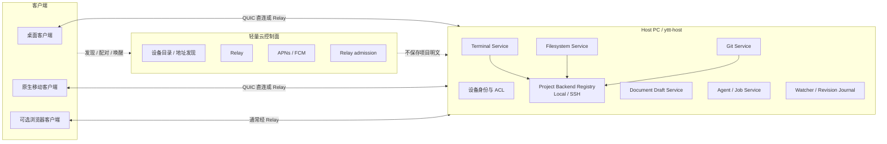

# yttt P2P、Relay 与多端远程架构

- 状态：Phase 1 本地 C/S Definition of Done 已完成；公网 P2P、Relay、移动端和协作能力尚未实现
- 更新：2026-08-12
- 原始代码基线：`master@01f5429`
- 实现基线：当前工作树
- 范围：桌面 Host、远程桌面客户端、原生移动客户端，以及可选浏览器客户端
- 目标：在保留本地终端性能的前提下，为终端、文件系统、Git 和 Agent 提供 P2P 直连、Relay 回退、多端同时在线和跨端继续工作能力

## 1. 结论

需要在实现本地 daemon 之前规划远程架构，但不需要一次性实现全部远程功能。

需要先固定的不是 Relay 厂商，而是以下边界：

1. Host 是终端、文件系统、Git 和 Agent 的权威节点。
2. P2P 只描述连接路径，不改变状态所有权。
3. Relay 只转发端到端加密流量，不保存项目状态。
4. Shared Resource、Shared Collaboration State 和 Per-client Presentation State 必须分离。
5. 一个 PTY 只有一个权威尺寸和一个输入控制者。
6. 文件写入、文档草稿和终端输入都需要 revision 或 lease。
7. 协议不得暴露 Host 绝对路径，也不得把 Rust 内部 enum 直接当作长期 Wire ABI。
8. 移动端后台应按可能断线设计，通过快照和事件序列恢复。

`master@01f5429` 已具备 SSH Project、SFTP、远程终端和稳定资源 ID，但这些能力当时仍由 `WorkbenchView` 生命周期管理。当前实现已把本地/SSH terminal、项目文件与 Git、Agent 子进程及 hook ingress、SSH runtime 和凭据所有权迁入独立 `yttt-host` 进程；桌面 UI 通过带认证的本地 IPC 使用这些资源。`docs/plans/2026-08-12-local-host-and-remote-follow-up-checklist.md` 的 Phase 1 行为、恢复、安全、性能、资源、三平台和产品 smoke 验收已经完成。加入移动端和远程网络路径后，目标仍是扩展同一 `yttt-host` 资源服务，而不是另建只包装 PTY 或 SSH channel 的 daemon。

### 1.1 本地 C/S 实现状态

已落地：

- 独立 `yttt-host` 进程、单 profile 单实例、随机 256-bit bearer token、Unix socket/Windows named pipe 本地传输和固定帧头协议。
- Host 持有本地/SSH terminal、项目 tree/read/write/Git、Agent 子进程与 hook ingress、SSH runtime 和凭据访问；GUI 不再拥有这些后端资源。
- `yttt-client-core` 处理握手、重连、请求关联、事件订阅、terminal attach/checkpoint 和语义 viewport 镜像。
- GUI terminal 使用 Host 的语义 snapshot/delta 渲染；输入、resize、scroll、title、bell、退出、lease 和 detach/terminate 语义跨 IPC。
- 窗口关闭只 detach；Host 进程和 terminal 生命周期不再依附 GPUI view。显式 terminate、drain/stop 和进程异常退出分别有独立路径。
- 本地/SSH 项目与 Agent hook 通过 Host 请求/事件路径工作；Host 是 SSH keyring 凭据唯一访问者。
- 开发、测试和 production profile 的 endpoint、token、runtime root、credential namespace 隔离；构建产物包含 Host 进程所需的同一可执行文件。
- 项目注册进入 Host resource catalog；Host 重启丢失注册状态时，客户端按类型化 `NotFound` 自动重新注册并更新 watcher epoch。
- Desktop 使用 `QuitMode::Explicit`、single-owner desktop-shell endpoint 和 native
  tray/menu-bar adapter；关闭最后窗口后可重开，Host lifecycle 也可通过 tray 或 CLI 独立控制。
- Host 加固（H0–H3）已落地：回放环按订阅分级、Git/远程命令为结构化 allowlist、`ClientRequest` 预留 `actor_device_id`/`lease_epoch` 与 capability 检查点，SSH 凭据挑战只发给连接发起方。真实设备 ACL 仍属 P3-3。

Phase 1 验收已完成：

- 性能 runner 覆盖同机五轮 direct/Host 原始结果、五类 workload、0/1/4/16 local pane、SSH pane、多客户端和 desktop reopen 矩阵。
- 严格门槛覆盖 Host-only idle CPU、combined RSS、交互延迟、绘制节奏、final sentinel 和零 backlog。
- 三平台 CI 覆盖 macOS bundle、Windows installer/named-pipe/upgrade、Linux headless/tar 产品 smoke。
- 产品 smoke 覆盖 local shell、SSH/SFTP/Git/host-key、Agent reconnect、双客户端、慢客户端、desktop reopen 和 Host crash。

本地 C/S 范围之外、尚未落地：

- 公网 P2P、NAT 穿透、Relay 和端到端加密远程传输。
- 移动端/浏览器客户端、多用户授权、跨设备配对。
- 公网远程访问的登录授权、设备配对和 capability ACL；本地 Host 登录启动与三平台用户级后台注册已经落地。
- 文档多人协作、跨端 writer handoff 和 CRDT；当前实现提供单机多客户端基础。

## 2. 目标与非目标

### 2.1 目标

- 同一协议支持本机 UI、远程 PC 和移动端。
- 优先 P2P 直连；NAT 或防火墙阻止直连时自动经过 Relay。
- Relay 无法读取终端、文件和控制消息明文。
- GUI 关闭或客户端断网后，Host 上的终端和任务继续运行。
- 多客户端可以观察同一终端和文档。
- 在 PC 与移动端之间显式转移终端控制权和未保存文档的编辑权。
- 文件树、Git 状态和外部文件变更支持增量同步与断线恢复。
- 慢客户端不能阻塞 PTY、其他客户端或文件系统 watcher。
- 本地客户端保留低延迟路径，不经过公网 Relay。
- 桌面关闭最后一个窗口时可由托盘继续管理 Host；启动、停止、重启和“退出全部”都有显式语义。
- 自动测试、GUI smoke 和手动开发实例可以与已安装的生产 Host 并行运行，且永不隐式连接生产 endpoint 或读写生产状态。

### 2.2 当前远程产品非目标

- Host 关机后继续访问其文件系统。
- 多人同时编辑同一文件。
- 多设备离线编辑后自动 CRDT 合并。
- 浏览器客户端 P2P 直连。
- Relay 保存工作区副本。
- 不受信任用户之间的项目级 shell 沙箱。
- 用户尚未登录时提供 machine-wide Host。当前 Host 属于登录用户会话；登出、关机和睡眠仍会使远程资源不可用。

这些能力可以后续增加，但不应阻塞 Host/Client 边界落地。

## 3. 原始基线观察与已实现接缝

### 3.1 `master@01f5429` 的终端是进程内管线

原始链路为：

```text
GPUI input
  -> TerminalView
  -> bounded writer queue
  -> PTY writer

PTY child
  -> PTY reader
  -> bounded read queue
  -> VTE parser
  -> alacritty Term
  -> coalesced redraw
  -> GPUI snapshot / paint
```

原始基线相关实现：

- `src/ui/terminal/pane.rs`：`TerminalPaneView` 直接持有 `PortablePtySession`。
- `crates/yttt-terminal/src/view.rs`：`TerminalView`、VTE 状态、输入、终端副作用和渲染入口。
- `crates/yttt-terminal/src/pty/driver.rs`：reader、parser、writer 线程及有界队列。
- `crates/yttt-terminal/src/event.rs`：终端事件 mailbox 和 redraw 合并。
- `crates/yttt-terminal/src/render/content.rs`：面向 GPUI 的可见帧快照。

原始终端每个 pane 约有 reader、parser、writer 三个工作线程。读缓冲固定池约为九个 64 KiB buffer；输入和回复队列也有上限。redraw 已经强合并，持续输出不会为每个小块触发一次绘制。当前实现把前三段和权威 parser 移入 Host，GUI 只保留语义 mirror、交互状态与 GPUI paint。

### 3.2 原始 Workbench 混合了共享状态和本地呈现状态

`src/ui/workbench/mod.rs` 中的 `WorkbenchView` 同时持有：

- `Workspace`
- editor/document runtime
- terminal GPUI entities
- focus
- sidebar/split drag
- settings/theme
- file watcher
- notifications

`crates/yttt-core/src/model/workspace.rs` 中的 `Workspace` 还包含：

- `selected_project_id`
- `selected_tab_id`
- `focused_pane_id`
- pane process state

这些字段在单窗口本地应用中合理，但不能整体变成 Host 全局共享状态。否则移动端切换 tab 或 pane 时会改变 PC 的焦点和布局。

### 3.3 原始文件 ID 与 Host 本机路径耦合

`src/ui/editor/workspace.rs` 中的 `DocumentId` 包含 `canonical_path: PathBuf`。远程客户端不应保存或依赖 Host 的绝对路径。

`src/ui/editor/file_io.rs` 已提供可复用的安全基础：

- 项目相对路径规范化
- canonical root 边界检查
- 文件 fingerprint
- compare-and-swap 式冲突检测
- 临时文件写入后 rename

但当前 `DiskFingerprint` 含 `SystemTime` 和本地 64-bit hash，不应直接作为长期网络协议中的 revision。

### 3.4 原始 watcher 只跟随活动项目

`master@01f5429` 中 `src/ui/workbench/project_files.rs` 的 watcher 根据当前选中项目创建，并在 150 ms 内合并通知事件。当前实现由 Host 为每个已注册本地项目持有 watcher，发布带 `ProjectId` 和 registration epoch 的规范化变更事件；GUI 只合并刷新，不再直接监听项目目录。

### 3.5 原始终端尺寸和协议回复由客户端产生

`TerminalView::apply_viewport_size` 在客户端 viewport 变化时同时：

- resize 本地 `Term`
- resize PTY
- 清理 render cache

`TerminalView::process_events` 还会处理：

- 颜色查询回复
- textarea/window size 查询回复
- `PtyWrite`
- clipboard
- title

多客户端各自解析同一原始 PTY 流时，可能对一次查询回复多次，或根据不同窗口尺寸给出不同答案。因此，多端模式不能简单地让每个客户端都成为有副作用的权威 parser。

### 3.6 `master@01f5429` 已形成可复用的 Host 接缝

该 master 基线比最初分析版本更接近 Host/Client 分层：

| 基线能力 | 可直接复用的部分 | 当时仍需补齐的 Host 语义 |
|---|---|---|
| `ProjectId`、`ProjectInstanceId`、`ProjectDescriptor`、`ProjectLocation` | 稳定项目身份、一次打开实例和 Local/SSH 位置模型 | Wire ID 的 Host 命名空间、Host 分配的 epoch、位置隐私 |
| `src/runtime/project.rs::ProjectServices` | Local/SSH 文件、目录、Git 操作已经经过统一 facade | 异步流式 I/O、订阅、revision journal、ACL 和取消 |
| `yttt-ssh::TransportService`、SFTP、`RemoteTerminalSession` | SSH 连接状态机、主机密钥验证、凭据、远端 PTY 和 resize | 从 Workbench 移入 Host、连接持久化、共享订阅和多客户端 lease |
| `TerminalPaneSession::{Local,Ssh}` | UI 已不必区分本地与 SSH 的读写/resize 细节 | pane drop 仍会结束 session，终端 parser 和 session registry 仍在 GUI |
| `WorkAreaState`、`ProjectWorkItemSession` | terminal/file 排序、tab group 和 split placement 已独立成较清晰的视图模型 | 必须按 `ClientInstanceId` 持有，不能成为 Host 全局 layout |
| `yttt-agent-core::{AgentSnapshot,AgentEventKind}` | 可序列化 snapshot/event/reducer 适合作为同步模型基础 | `AgentManager` 和 hook server 仍由 Workbench 持有，需要 Host 持久化、sequence 和 ACL |

其中最重要的边界是 `ProjectServices`：它证明文件和 Git 已能按 Local/SSH backend 路由。当前实现没有再造第三套 GUI 文件路径，而是增加 Host project registry 和统一 wire contract；远程客户端始终调用同一 workspace contract，Host 再决定操作本机目录还是经 SSH/SFTP 转发。

SSH 支持与 P2P 多端不是同一层：

```text
mobile / remote PC
    -> P2P or Relay
    -> yttt-host
    -> LocalProjectBackend
       or SshProjectBackend -> SSH server
```

SSH connection ID、凭据、远端绝对 root 和 host-key policy 必须留在 Host。客户端只看到 opaque workspace、能力和连接状态。这样桌面 Host 可以成为 SSH 项目的统一 gateway，终端控制权、文件 revision、Agent 状态和审计仍只有一个权威来源。

原始 SSH terminal 的 command channel 和 output channel 都是无界队列，适合单个本地 pane 的桥接，但不能直接成为多客户端 fan-out 边界。当前 Host terminal 分发改用有界队列、语义更新合并和 per-client sequence/checkpoint；SSH 的底层连接仍由 Host 独占。

### 3.7 原始桌面生命周期与测试隔离不足

`master@01f5429` 的 `src/ui/app/mod.rs` 显式使用 `QuitMode::LastWindowClosed`，因此所有平台关闭最后一个窗口都会退出 GPUI 进程。macOS 还在 `prepare_macos_app_runtime` 中强制 `NSApplicationActivationPolicyRegular`。`request_window_close` 会把 dirty document 和 running pane 一并纳入关闭确认，因为当时 window、Workbench、terminal session 和进程生命周期尚未分离。

该基线也没有完整的实例 namespace：

- `AppConfigPaths` 只包含一个 `config_dir`，正式入口在多个位置直接调用 `AppConfigPaths::for_app()`；没有 profile、data/state/cache/runtime root 或 local endpoint。
- Rust 单元和 GPUI 测试大多显式使用 `tempdir + AppConfigPaths::from_config_dir`，这部分隔离基础是正确的。
- `scripts/run-dev-app.sh` 虽使用独立 bundle ID 和 `YTTT_DEV_FIXTURE`，但仍调用默认 `AppConfigPaths::for_app()`，并用 `open -n` 允许多实例；process-level smoke 可能与正式应用读写同一配置。
- `AppConfigPaths::project_layout_file` 指向项目内 `.yttt/layout.toml`，只替换用户 config root 仍可能修改真实项目。
- `CredentialStore` 使用固定 keyring service `dev.yttt.ssh`，不受 `AppConfigPaths` 约束；测试凭据可能进入真实 Keychain、Credential Manager 或 Secret Service。
- Agent session/root 仍会读取 `HOME`、`CODEX_HOME`、`CLAUDE_CONFIG_DIR` 等进程环境；managed hook 和 provider 路径也有用户目录副作用。
- macOS bundle、Windows installer 和 Linux tar 当时都只打包一个 GUI role；尚无独立 Host process role、profile lock、托盘或登录启动注册。

因此，C/S 测试隔离不能只加 `--config-dir`。当前实现已由同一个 typed profile 在 composition root 一次性注入配置、运行时 endpoint、Host 身份、凭据 namespace、项目写入策略、Agent 目录和进程所有权；网络发现仍属于后续公网远程范围。

## 4. 已有性能基线

以下数据在 2026-07-16 的 Apple M4 上，以 release 构建的独立 `yttt-terminal` 测得，不包括完整 Workbench。临时测量产物未提交，正式实现前应使用仓库性能脚本重新建立可重复基线。

| 指标 | 实测结果 |
|---|---:|
| 空闲 GUI RSS | 80.6 MiB |
| GUI 线程数 | 8，其中终端工作线程为 3 |
| shell RSS | 约 4.0 MiB，不计入 GUI |
| 11,237,271-byte 语料，120×68，稳态均值 | 118.2 ms |
| 对应吞吐 | 95.1 MB/s，90.7 MiB/s |
| 五轮输出并填充 scrollback 后最大 RSS | 113.4 MiB |

仓库 `scripts/run-terminal-perf.sh` 的五秒高负载还观测到：

- 读取 59.6 MB，约 11.3 MiB/s；该 workload 生成器自身漏帧，因此不是终端上限。
- paint 约 60.14 FPS。
- parser p95 约 0.0055 ms。
- prepaint p95 约 0.273 ms。
- paint p95 约 0.122 ms。
- redraw 合并率约 99.50%。
- 输入到 PTY 写入 p95 约 0.048 ms。
- 输入回显到首次绘制 p95 约 16.55 ms。

结论：本地 parser、paint 和 redraw 合并当前没有明显瓶颈。远程架构的主要价值是生命周期、隔离和多端连接，而不是提升本地渲染速度。

本地 C/S 核心进程边界切换后，于 2026-08-12 在同一台 Apple M4 上重新测量 release 构建：
| 指标 | 实测结果 |
|---|---:|
| 独立 Headless Host 空闲 RSS | 13,632 KiB |
| 独立 Headless Host 空闲线程数 | 13 |
| 8 MiB PTY 输出经 Host parser、60 Hz 语义更新和本地 IPC 到 client mirror | 321 ms，24.85 MiB/s |
| 上述活动 terminal 探针期间 Host RSS | 20,496 KiB |
| 同一连接 200 次本地 IPC ping | p50 14 µs，p95 22 µs |

该吞吐探针包含 shell/PTY、Host parser、语义 delta、协议编解码和客户端 mirror 应用，不能与上表只测独立终端稳态 parser/render 的 90.7 MiB/s 直接相除；它仍是现有 11.3 MiB/s 高负载生成器负载的约 2.2 倍。Host 输出捕获按 16 ms 合并，空闲后的首个更新立即发布，持续输出最多生成约 60 次语义更新/秒，因此不会按 PTY read 次数放大 IPC 和绘制工作。

Phase 2 tray 控制面完成后，于 2026-08-12 在同一台 Apple M4 上测量 release 构建。
macOS 沿用性能 runner 的 acceptance metric，使用 `footprint` 的 physical footprint，而不以
共享映射和压缩页影响较大的 RSS 作为进程间比较依据：

| 状态 | Desktop footprint | Host footprint | 合计 |
|---|---:|---:|---:|
| Host only | — | 4.55 MiB | 4.55 MiB |
| Host + GPUI/tray，无窗口 | ≤55.03 MiB | 4.88 MiB | ≤59.91 MiB |
| Host + 重开窗口 | 106.42 MiB | 4.67 MiB | 111.10 MiB |

同 profile 的第二次 desktop invocation 在 9.3 ms 内完成 single-owner 转发；从启动 invocation
到 WindowServer 观测到重开窗口为 171.2 ms。无窗口值通过 release 进程内关闭 GPUI window
后采集；关闭动作需要调试器辅助，因此该值作为包含测量扰动的保守上界。当前数据没有证明
需要增加第三个 `yttt-tray` 进程：两进程方案在无窗口时已经比重开窗口减少约 51 MiB
physical footprint，且窗口恢复低于 0.2 s；后续只有明确的常驻内存预算要求低于该上界时才
重新评估三进程方案。


作为参考，本机编译后的 tty7 daemon 测量结果为：

| 状态 | 资源 |
|---|---:|
| 空 daemon | 10.7 MiB RSS，1 线程 |
| 一个空闲已附着 pane | 11.9 MiB RSS，4 线程 |
| 8 MiB 回放环填充后 | physical footprint 峰值 21.6 MiB |

这些数据只说明 daemon 的资源量级，不能直接作为 yttt-host 的预算；yttt-host 还会包含网络、文件监听、文档和 Git 服务。

## 5. 目标拓扑



### 5.1 Host 权威资源

- workspace 注册和 root capability
- Local/SSH project backend registry；SSH transport、凭据和远端 root 只存在于 Host
- 实际 backend 机器上的 PTY、shell、Agent 和其他子进程；对客户端统一表现为 Host 资源
- 终端权威 parser、尺寸和输出序列
- 文件系统内容和 metadata
- 文件 watcher
- Git 状态和 mutation
- 未保存文档草稿
- device ACL 和审计

### 5.2 共享协作状态

- 在线设备和客户端实例
- terminal controller lease
- document writer lease
- terminal canonical geometry
- document draft revision
- 可丢弃的 presence

### 5.3 每客户端呈现状态

- window bounds、DPI、字体和主题
- selected project/tab/pane
- split/sidebar 布局
- 打开的 resource placement
- editor cursor、selection、scroll
- terminal selection、search、display offset
- palette、dialog、toast

### 5.4 可选漫游状态

- 用户设置
- layout preset
- recent workspace
- activity bookmark

漫游状态应与 Host 资源协议分开，后续可通过加密 profile sync 实现。

### 5.5 桌面进程边界

最终形态应至少有两个 OS 进程，但不要求有两个物理 executable。第一阶段推荐同一个签名和版本化的 `yttt` binary 以不同 process role 启动：

```text
yttt --process-role=host
    headless Host process
    one process per ProfileId
    owns terminal/files/Git/Agent/network
    never initializes GPUI or tray

yttt
    desktop process (default role)
    GPUI windows + tray/menu-bar shell
    one tray owner per ProfileId
    may exit without terminating the Host process

second desktop invocation
    -> forwards OpenWindow/OpenPath to the existing desktop shell
    -> never creates a second tray for the same profile
```

仅把现有 GPUI 进程改成“关闭窗口后留在托盘”不能作为最终 C/S：GUI crash 仍会带走 PTY、SSH 和 Agent。托盘是 Host 的控制面和可见状态，不是 Host 存活的根。

Host 启动必须处理并发竞争：

1. Desktop 根据 `ProfileId` 解析明确的 local endpoint。
2. 先尝试连接并校验 profile、environment、protocol 和 build compatibility。
3. endpoint 不存在时争抢 profile-scoped launch lock；只有胜者以当前 executable 的 `--process-role=host` 模式启动 Host。
4. 其余客户端等待 ready record，再连接新 Host。
5. ready record 带 host epoch 和随机 instance nonce，不能只信 PID 或残留 socket。
6. 已存在但版本不兼容的 Host不得被新 GUI 静默杀死；先报告 active resource，再显式 drain/restart。

Host lock 与 desktop-shell lock 必须分离：同一 profile 只有一个 Host 和一个 tray owner，但可以有多个远程客户端和多个 GPUI window。

这里必须区分“共用二进制”和“共用进程”。共用二进制只减少安装产物；desktop 与 Host 仍是两个独立进程、两个 crash domain 和两套 lifecycle。把 Host resource owner、GPUI 和 tray 放回同一进程会重新引入 GUI crash 终止 terminal 的问题，不采用。

单二进制的 bootstrap 必须满足：

1. `process-role` 在创建 GPUI `App`、tray、字体/GPU resource 和读取普通 desktop 配置前完成解析。
2. Host crate/module 的依赖图不允许依赖 GPUI、tray 或 desktop state；顶层 binary 只负责按 role 组装。
3. Host mode 必须显式接收 profile、endpoint 和 lifecycle capability；启动失败不能回退到 desktop，desktop 也不能静默退化为 in-process Host。
4. Host/desktop 分别持有 profile-scoped lock；不能因为 executable path 相同而按进程名发现、清理或授权。

| 方案 | 优点 | 代价 |
|---|---|---|
| 单 binary、双进程 | 安装、签名、spawn path 和同版本首次启动最简单；测试只需定位一个当前构建产物 | binary 包含 UI 代码和动态依赖；运行中的旧 Host 仍可能与升级后的 GUI 版本不同；Windows GUI subsystem 不适合作为交互式 CLI |
| `yttt` + `yttt-host` 双 binary | 可提供真正精简的 headless 包；Host loader 不需要 GUI 动态库；可独立做资源预算 | 打包、签名、版本配对和测试产物定位更复杂 |

因此第一阶段选择单 binary、双进程，同时保持 crate 边界，使以后拆成 `yttt-host` executable 只是 composition root 和打包调整，不迁移资源实现。出现以下任一条件再拆：需要无 GUI 依赖的 Linux/headless 安装、实测 Host-only RSS/启动时间被 UI 链接依赖显著抬高、平台登录启动必须使用独立 helper，或 updater 需要独立替换 Host。

### 5.6 启动、关闭与保活策略

建议对用户暴露三个明确策略：

| 策略 | 行为 | 适用场景 |
|---|---|---|
| `FollowDesktop` | desktop shell 退出后，若无其他客户端和持久资源则停止 Host | 迁移期、测试或明确不需要后台 |
| `KeepAlive` | 第一次打开 yttt 时启动 Host；之后只有显式 Stop、登出或关机才停止 | 推荐的普通桌面默认 |
| `StartAtLogin` | OS 用户登录后启动 Host；desktop window 可不自动显示 | 已启用远程访问的推荐配置 |

首次启用远程访问或完成设备配对时，应提示用户开启 `StartAtLogin`，不能在安装时无提示注册后台启动。第一阶段只保证“用户已登录”期间可用；macOS logout、Windows sign-out 和未启用 linger 的 Linux user session 都会结束 per-user Host。

操作语义必须拆开：

| 用户操作 | 资源语义 |
|---|---|
| 关闭一个窗口 | 关闭本地 placement、退订不可见资源；Host terminal 和 draft 不变 |
| 关闭最后一个窗口 | desktop shell 继续驻留托盘；Host 不变 |
| `Quit Desktop` | 退出 GPUI/tray；Host 按 lifecycle policy 保留或安全停止 |
| `Stop Host` | 默认发送 `StopIfIdle`；有 terminal、dirty draft、job、mutation 或其他 client 时返回 typed `Busy` |
| `Drain and Stop` | 拒绝新 resource，等待可结束操作；仍需用户处理交互式 terminal 和 dirty draft |
| `Force Stop` | 明确二次确认后终止子进程并使所有 lease/epoch 失效 |
| `Restart Host` | 等价于安全 stop + 新 host epoch；不能绕过 busy 检查 |
| OS logout/shutdown | 接收有限宽限期，持久化可恢复状态并终止进程；不得假定永远能完成 |

这会改变现有关闭保护：running pane 不再阻止普通 window close；Host-owned dirty draft 也不应在 detach 时被丢弃。真正的全局危险确认应移动到 `Stop Host`、`Quit All` 和显式 terminate resource。

### 5.7 托盘菜单

Production desktop 已切换到 `QuitMode::Explicit`，并通过独立的 `tray-icon` adapter 持有
profile-scoped tray/menu-bar。Host role 不初始化 GPUI、AppKit、Win32 或 GTK event loop。
macOS/Windows 使用 native adapter；Linux 或没有可用 tray/AppIndicator 的环境继续通过
Settings/CLI lifecycle path 工作，不把 tray 当作唯一控制入口。

当前菜单：

```text
Host: <state> · <terminal> terminals · <client> clients · <job> jobs
Open yttt
New Window
Open Logs
Start Host
Stop Host If Idle
Restart Host If Idle
Quit Desktop
Quit All
```

`TrayIcon` 由 desktop event-loop thread 创建和使用；Host 状态经有界 channel 更新，
menu event 再转发到 GPUI foreground executor。同一 profile 的 desktop-shell endpoint
保证只有一个 tray owner，后续 invocation 只转发 Activate/OpenWindow。所有 menu action
只调用 desktop-shell 或 Host lifecycle protocol，不直接 kill PID。托盘崩溃或 desktop
被强制退出时，独立 Host 仍继续运行。

`Start Host at Login` 已在 Permissions 中提供显式首次确认、平台注册状态和关闭入口；
macOS `SMAppService`、Windows 当前用户 Run key、Linux systemd user/XDG fallback 均只注册
`--start-host` 与稳定 profile，不写入 secret。`Remote Access` 和 `Pair Device` 仍属于
Phase 3，在设备身份、配对和 capability ACL 落地前不能显示伪状态。

托盘进程归属有明确资源权衡：

- 第一阶段推荐由现有 `yttt` desktop shell 持有 tray。改动最少，重开窗口最快，但关闭全部窗口后 GPUI、字体和部分 UI cache 仍可能常驻。
- Host process role 绝不能持有 tray；否则 Host 会重新依赖 AppKit/Win32/GTK event loop，破坏 headless、无桌面 Linux 和 crash isolation。
- `Quit Desktop` 应允许退出整个 GPUI/tray 进程而单独保留 Host；用户再次打开 yttt 或使用非 tray control path 时再管理 Host。
- 如果实测无窗口 GPUI RSS 不可接受，可后续拆出第三个轻量 `yttt-tray` 进程。它与 desktop 一样只调用 Host control protocol，不获得资源所有权。

因此“托盘保活”保活的是用户可见控制面，不应成为 Host 的技术保活条件。两进程方案先落地；是否增加第三个轻量 tray 进程由无窗口 RSS、重开延迟和跨平台维护成本的实测决定。

### 5.8 平台差异与打包

| 边界 | macOS | Windows | Linux |
|---|---|---|---|
| Tray | AppKit 主线程；当前 app 为 Regular activation policy。第一版保留 Dock + menu-bar，动态切 Accessory 后置 | Win32 event loop；notification-area icon | `tray-icon` 需要 GTK/AppIndicator，桌面环境支持不一致，不能作为唯一入口 |
| 登录启动 | macOS 13+ 使用 `SMAppService` 注册 bundle 内 LoginItem/LaunchAgent | per-user `HKCU\\...\\Run` 或对应 packaged startup task；不使用 Session 0 Windows Service | 优先 systemd user service；无 systemd 时回退 XDG autostart |
| Local IPC | profile-scoped UDS + `0600`/父目录权限，注意 Unix socket path 长度 | profile-scoped named pipe + user/logon-SID DACL；profile mutex | `$XDG_RUNTIME_DIR/yttt/<profile-hash>` 下 UDS + `0700` runtime root + lock |
| 测试进程树 | lifetime pipe + process group，协议 shutdown 后再强杀 | lifetime pipe + Job Object `KILL_ON_JOB_CLOSE` | lifetime pipe + process group；有 systemd 时仍不能让 test 注册真实 user unit |
| 无桌面环境 | Host mode 不创建 AppKit window；仍属于登录用户 | Host mode 作为普通用户后台进程，不是 service session | 安装 desktop package 依赖后，Host mode 必须在无 DISPLAY、Wayland、DBus 时运行；若要求未安装 GTK/GUI 动态库的纯 headless 环境，则必须拆分 `yttt-host` binary |

第一阶段三个安装产物都按“一个 executable、两个 process role”调整：

- macOS `.app` 仍只打包一个签名的 `yttt` Mach-O；bundle 内 LaunchAgent 通过 `SMAppService` 以 `--start-host --profile-id default` 启动同一 executable，签名校验、原位 bundle 更新、真实注册和 Host role 启动 smoke 已验证，无需额外 helper。
- Windows installer 安装一个 `yttt.exe`，per-user startup command 显式携带 Host role 和 profile；卸载/升级前仍需通过协议 drain，因为运行中的同名 Host 会锁定 executable。
- Linux tar 安装一个 `yttt`、可选 systemd user unit 和 XDG autostart template；`ExecStart` 显式选择 Host role。若发布纯 headless 包，则由同一 Host crate 额外产出不链接 GPUI/tray 的 `yttt-host`。
- 单 binary 不消除版本协商：macOS/Linux 替换磁盘文件后旧 Host 仍可继续运行旧映像，Windows 更新则通常必须先停止占用文件的进程；新 desktop 都必须通过 handshake 检测 build/protocol compatibility。

## 6. Resource 与 View Placement 分离

现有 `PaneConfig` 同时描述命令、退出策略和 split tree 中的位置。应拆为：

```text
TerminalSessionSpec
    command
    cwd
    env
    restart_policy

TerminalSession
    session_id
    process_state
    canonical_terminal_state
    canonical_geometry

ViewPlacement
    client_instance_id
    resource_id
    local_tab_id
    local_split_path
    presentation_options
```

同一个 `TerminalSession` 可以：

- 在 PC 上显示于四分屏。
- 在移动端全屏显示。
- 在第二台 PC 上只读观察。

移动端和 PC 不需要共享同一棵 split tree。Shared layout 可以作为模板或 preset，但活动布局属于客户端。

`master@01f5429` 中的 `WorkAreaState` 已经将 terminal/file work item、tab group 和 split placement 从旧 layout tree 中抽出，可作为 `ViewPlacement` 的迁移起点。但它仍是本地 UI 状态：服务端只保存 `resource_id` 和共享生命周期，`WorkAreaState` 应由每个 `ClientInstanceId` 各自持有并引用这些资源。

## 7. P2P 与 Relay 传输

### 7.1 第一候选：Iroh

对于 Rust Host、桌面客户端和原生 iOS/Android 客户端，Iroh 是当前的第一候选：

- Endpoint 使用 Ed25519 身份。
- 连接为 QUIC，提供双向和单向 stream。
- 自动尝试 P2P 直连。
- 无法直连时通过端到端加密 Relay 转发。
- 官方支持 macOS、Windows、Linux、Android 和 iOS。
- Relay 是无状态的连接设施，不持有应用数据。

生产环境不应依赖公共 Relay。Iroh 官方将公共 Relay 定位为开发和测试用途，生产应使用专用或自托管 Relay。

### 7.2 浏览器

Iroh 可以在浏览器中运行，但浏览器目前不能发送任意 UDP，因此浏览器连接必须经过 Relay。流量仍然端到端加密。

如果浏览器 P2P 直连是硬需求，应单独评估 WebRTC DataChannel、ICE 和 TURN。不要自行实现 NAT traversal。

### 7.3 本地路径

本机 UI 不应绕行 QUIC 或 Relay。建议同一应用协议支持：

- in-process transport，用于测试和迁移期。
- UDS 或平台本地 IPC，用于本机 UI。
- Iroh/QUIC，用于远程 native client。
- 可选 WebRTC/WebTransport adapter，用于未来浏览器。

应用协议应依赖可靠 stream、unreliable presence 和 connection identity 能力，而不是依赖某个具体 SDK 类型。

## 8. 协议与通道

建议一个客户端和一个 Host 建立一个长期连接，内部使用多个 QUIC stream。

| 优先级 | 通道 | 内容 |
|---|---|---|
| 最高 | Control | handshake、auth、capability、lease、cancel、error |
| 最高 | Terminal Input | text、key、mouse、paste、resize |
| 高 | Terminal Output | output sequence、checkpoint、delta |
| 高 | Document Ops | draft operations、writer lease、cursor presence |
| 中 | Filesystem Events | tree snapshot、watch event、revision |
| 中 | Git Events | status、diff progress、mutation result |
| 低 | Blob Transfer | 大文件、上传、下载、checkpoint blob |
| 可丢弃 | Presence | 在线状态、正在查看的 resource |

### 8.1 通用 envelope

```text
Request
    request_id
    protocol_version
    actor_device_id
    client_instance_id
    resource_id?
    expected_revision?
    lease_epoch?
    body

Response
    request_id
    result | typed_error

Event
    resource_id
    resource_epoch
    sequence
    body
```

### 8.2 规则

- Mutation 必须可按 `request_id` 去重，支持网络切换后的安全重试。
- 不使用 wall clock 决定事件顺序或控制权。
- Host 重启后生成新的 `host_epoch`，旧 lease 和缓存 revision 失效。
- 每个资源维护自己的 sequence，不使用阻塞所有服务的全局 sequence。
- Snapshot 包含 base sequence，随后只应用更大的 event sequence。
- Sequence gap 或 journal 淘汰时返回 `ResnapshotRequired`。
- 控制消息使用可演进的 schema，例如 Protobuf。
- 文件和终端 payload 使用二进制 framing，不把大块 bytes 塞进 JSON。
- 大文件使用独立 stream、分块 hash、resume 和 cancel。
- 第一版使用一个 QUIC connection 和应用层优先级调度；只有基准表明 connection-wide flow control 影响终端延迟时，才把 bulk transfer 拆为第二条连接。

### 8.3 与现有 ID 类型的映射

不要为协议重新发明已有身份，也不要复用语义相近但所有权不同的 ID：

| Wire 概念 | master 现有类型 | 决策 |
|---|---|---|
| `HostId` | 无 | 新增，由 Host 设备身份派生或绑定 |
| `WorkspaceId` | `ProjectId` | Wire 上按 `HostId + ProjectId` 寻址；不发送完整 `ProjectLocation` |
| `WorkspaceEpoch` | `ProjectInstanceId` | 可复用“打开实例”的概念，但必须改为 Host 创建和发布，不能由各客户端独立生成 |
| `TerminalSessionId` | 当前主要使用 `PaneId`/字符串 | 新增共享资源 ID；`PaneId` 留给客户端 view placement |
| `ClientInstanceId` | 无 | 新增；不能复用 SSH `ConnectionId` |
| `DocumentSessionId` | `DocumentId { project_id, canonical_path }` | 新增 opaque session ID；路径作为独立的 workspace-relative 字段 |
| `AgentResourceId` | `AgentInstanceId` | 保留现有实例 ID，并增加 Host/workspace 作用域 |

`TabId`、`PaneId`、split node ID 和选中/聚焦字段属于客户端布局。`ConnectionId` 只标识 Host 的上游 SSH 配置。跨层复用这些 ID 会把 UI 生命周期或 SSH 实现泄漏进长期 Wire ABI。

## 9. 身份、配对与授权

### 9.1 身份模型

建议分离：

- User identity
- Device identity
- Transport endpoint identity
- Client instance identity

每个安装实例生成长期设备密钥。Host ACL 以稳定 `DeviceId` 为键，不把短期连接 ID 当作授权主体。

### 9.2 配对流程

1. Host 创建一次性、高熵、短时有效的 invitation。
2. Host 展示 QR，包含 Host fingerprint、EndpointID、invitation ID 和 secret。
3. 移动端通过直连或 Relay 建立端到端加密连接。
4. 双方绑定设备公钥并显示确认信息。
5. Host 用户确认权限。
6. Invitation 立即作废。

若使用短数字配对码，应采用 PAKE 类流程；不能把六位数字直接当作长期认证 secret。

### 9.3 Capability

至少拆分：

```text
workspace.list
fs.read
fs.write
terminal.observe
terminal.control
process.spawn
git.read
git.mutate
device.admin
```

Relay admission 只决定某个 endpoint 能否使用 Relay，不等于 Host 应用授权。

### 9.4 Shell 权限边界

获得 `terminal.control` 基本等同于获得 Host 当前 shell 用户的权限。客户端可以绕过文件 RPC 执行 `cat`、`rm`、`git` 或访问项目外路径。

因此：

- `terminal.control` 必须被视为高权限。
- 项目级文件 ACL 无法约束已经获得 shell 的客户端。
- 如果以后需要不受信任用户协作，PTY 必须运行在容器、sandbox 或受限 OS user 中。
- 远程 mutation 应记录 actor、resource、request ID 和结果，但不记录终端明文或敏感文件内容。

## 10. 多客户端终端模型

### 10.1 一个 PTY 只有一个权威尺寸

PC 可能是 160×48，移动端可能是 50×20，但一个 PTY 只有一个 `winsize`。不能让同一 shell 或 TUI 同时认为自己拥有两个尺寸。

建议每个终端维护：

```text
TerminalSession
    session_id
    process
    canonical_terminal_state
    canonical_cols
    canonical_rows
    geometry_epoch
    output_sequence
    controller
        client_instance_id
        lease_epoch
        expires_at
    observers
```

### 10.2 Controller 与 Observer

Controller 可以：

- 发送键盘、文本、鼠标和 paste。
- 改变 PTY 尺寸。
- 处理需要用户授权的 clipboard 操作。

Observer 可以：

- 接收输出和 checkpoint。
- 本地搜索、选择和滚动。
- 请求控制权。
- 以裁剪、缩放或水平滚动显示 canonical grid。

控制权不应因窗口 focus、鼠标移动或普通连接建立而自动转移。应通过显式 `RequestControl` 或 `ContinueHere` 执行。

### 10.3 PC 与移动端切换示例

初始状态：

```text
PC controls terminal at 160x48
Mobile observes the canonical 160x48 grid
```

移动端执行“在此继续”：

1. Host 使旧 lease 失效。
2. `lease_epoch += 1`。
3. PC 收到 `ControlRevoked`。
4. Host resize PTY 为 50×20。
5. `geometry_epoch += 1`。
6. Host 发布新 checkpoint。
7. 移动端只携带新 lease epoch 发送输入。
8. PC 继续观察 50×20，不得重新上报 160×48。

PC 取回控制时反向执行。旧客户端迟到的 input 和 resize 因 lease epoch 不匹配而被拒绝。

可增加 `PinnedGeometry` 模式，适合演示或结对场景；默认使用 controller-driven geometry。

### 10.4 不采用的策略

- 最大客户端尺寸。
- 最小客户端尺寸。
- 最后一次 resize 直接生效。
- 最后一次点击或输入全局抢占所有终端。
- 每个客户端用自己的尺寸独立解析同一 PTY 流。

Okena 的 `resize_authority` 证明了这个问题真实存在，但其 process-global “last interaction wins” 模型不适合 yttt 的多终端、多客户端场景。yttt 应使用每个 session 独立 lease。

### 10.5 Host 权威 parser

Host 必须成为唯一有副作用的 VTE parser：

- 生成 PTY protocol reply。
- 回答颜色和窗口尺寸查询。
- 维护 terminal modes、palette、cursor、title 和 cwd。
- 决定 OSC52 等敏感副作用是否允许。

客户端发送逻辑输入事件：

```text
TextInput
KeyInput
MouseInput
PasteInput
```

Host 根据 canonical terminal mode 编码后写入 PTY。这样不会因为不同客户端的 parser 状态差异产生重复或错误回复。

### 10.6 Checkpoint 与 live output

建议支持：

```text
TerminalCheckpoint
    geometry_epoch
    output_sequence
    dimensions
    active_screen
    bounded_scrollback
    cursor
    modes
    palette
    tab_stops
    title
    cwd

TerminalOutput
    start_sequence
    bytes
```

客户端正常在线时可应用 raw output。以下情况必须从 checkpoint 重置：

- 初次 attach
- reconnect
- geometry epoch 改变
- 客户端输出队列溢出
- output sequence gap
- protocol upgrade

当前 GPUI `TerminalRenderSnapshot` 只包含可绘制行、cursor、颜色和 damage 等呈现数据，并不包含完整 terminal mode，不能直接作为 Wire checkpoint。需要提取不依赖 GPUI 的 `yttt-terminal-core` 状态表示。

### 10.7 慢客户端

Host 必须始终 drain PTY 和推进 canonical parser。每个客户端有独立有界队列：

- 慢客户端不能反压 PTY。
- 慢客户端不能影响其他客户端。
- 队列溢出后停止发送旧 output，标记 `NeedsCheckpoint`。
- checkpoint 编码结果可在相同 geometry 的多个客户端之间共享。

## 11. 文件系统和文档一致性

### 11.1 Remote path

协议使用：

```text
HostId + WorkspaceId + RelativePath
```

不传 Host 绝对路径。`RelativePath` 必须：

- 按 segment 编码。
- 禁止 parent、root 和 platform prefix。
- 将用于身份的原始 segment 与用于 UI 的 display string 分开。
- 由 Host 再次验证和解析。

远程攻击面高于本地 UI。长期应优先使用 root directory handle/openat 风格的解析，减少 symlink 和 TOCTOU 风险，而不是只依赖字符串 canonicalize。

协议层已落地 backend-neutral 的 `ProjectRelativePath` / `HostPath` / `PathSegment`：按 segment 编码，拒绝绝对路径、parent 与 NUL，并用 `PathSegment::Bytes` 表示非 UTF-8 路径。`RemotePathBuf` 和 `ProjectLocation::Ssh` 只属于 Host backend，不应作为 P2P payload。

`ProjectServices` 可继续作为 Host 内部 Local/SSH facade，但当前 `read_file`/`save_file` 以完整 `Vec<u8>` 交付，不能承担大文件网络传输。Blob 通道必须流式分块，只有小文件操作才可复用一次性 buffer。

### 11.2 Revision

建议对外定义：

```text
FileRevision
    workspace_epoch
    revision_number
    content_digest
    byte_len
```

Host watcher 和 mutation 分配单调 revision。客户端提交写入时必须携带 base revision。

### 11.3 文件读写

```text
ListDirectory(workspace_id, path, revision?)
ReadFile(workspace_id, path, expected_revision?)
WatchWorkspace(workspace_id, after_sequence)

BeginWrite(path, base_revision, total_size, digest)
WriteChunk(offset, bytes)
CommitWrite
AbortWrite

Create(path, expected_parent_revision)
Rename(path, new_path, expected_revision)
Delete(path, expected_revision)
```

规则：

- 大文件不一次性构造完整 `Vec` 或 `String`。
- 上传先进入临时文件，校验长度和 digest，再原子 commit。
- 冲突时保留客户端或 Host draft，不覆盖当前磁盘内容。
- Rename 必须产生 `DocumentRelocated` 事件。
- Delete 打开文档时保留 tombstone/draft，等待用户决定。
- 长时间 copy/move 提供 progress 和 cancel。

### 11.4 文件 watcher

Host 对所有被订阅或正在运行任务的 workspace 维护 watcher：

```text
FsSnapshot { workspace_epoch, sequence, entries }
FsEvent { sequence, mutation }
ResnapshotRequired
```

原始 `notify` event 不直接发给客户端。Host 应合并、重新 stat 并分配确定的 sequence。terminal、Git、Agent 或外部编辑器造成的变更都通过同一链路广播。

### 11.5 DocumentSession 与单 writer

第一阶段采用 Host 上的单 writer draft，不引入 CRDT：

```text
DocumentSession
    document_session_id
    path
    base_file_revision
    draft_revision
    draft_content
    writer
        client_instance_id
        lease_epoch
    observers
    conflict_state
```

行为：

- PC 首先编辑时获得 writer lease。
- 移动端打开时收到同一 Host draft，但先只读。
- 移动端执行“在此继续”后，writer lease 转移。
- PC 转为 Observer。
- 未保存内容仍在 Host，不因设备切换丢失。
- 保存时对 `base_file_revision` 做 CAS。
- 外部磁盘修改发生在 dirty draft 上时进入 Conflict，停止 autosave。

这样能支持同一用户跨设备接力，而不需要多人 CRDT。

只有明确需要多人同时编辑或离线多主合并时，再在 `DocumentSession` 后面引入 CRDT/OT。协议现在应保留稳定 `ActorId`、`OperationId` 和 revision，但不要提前引入完整 CRDT 数据模型。

### 11.6 Git

Branch checkout、reset、clean 等会修改整个共享工作目录，必须是 Host 上的 workspace-level mutation：

- 串行化执行。
- 广播操作者和进度。
- 标记或暂停受影响的 dirty draft。
- 完成后触发 watcher rescan。

如果不同客户端需要同时使用不同 branch，应创建独立 Git worktree；不能让一个目录同时呈现两个 branch。

## 12. 多端状态与 Handoff

默认模式为 `IndependentView`：

- PC 保留自己的 tabs 和 split。
- 移动端以单资源或紧凑布局显示。
- 两端可观察相同 resource。
- 只有具体 resource 的 lease 会转移。

可增加：

- `FollowDevice`
- `ContinueHere`
- `RequestTerminalControl`
- `RequestDocumentWrite`
- `ReturnControl`

Handoff 只传逻辑 bookmark：

```text
ActivityBookmark
    workspace_id
    active_resource_id
    document_cursor?
    document_selection?
    terminal_session_id?
    source_client_instance_id
```

不传：

- window pixels
- split/sidebar width
- DPI
- font size
- overlay state

目标客户端以本地布局打开资源，再显式申请对应 lease。Terminal lease 和 Document lease 必须相互独立。

## 13. 离线、后台和故障语义

| 场景 | 语义 |
|---|---|
| 客户端短暂断网 | lease 保留短 grace，Host session 继续 |
| 客户端长期离线 | lease 释放，draft 和 terminal 保留 |
| 直连中断 | 尝试 Relay 或重连并 resume |
| Relay 故障 | 尝试其他 Relay；已有直连不依赖 Relay |
| 慢客户端 | 丢该客户端 backlog，改发 checkpoint |
| Host daemon 重启 | 新 `host_epoch`，旧 lease/revision 失效 |
| Host 睡眠或关机 | 远程 terminal 和 filesystem 不可用 |
| watcher event gap | `ResnapshotRequired` |
| 重复 mutation RPC | 根据 `request_id` 返回原结果 |
| 两客户端同时保存 | 第二个得到 Conflict |
| 移动端进入后台 | 按可能断线处理，之后 snapshot/resume |
| Relay 在线但 Host 离线 | Relay 不执行项目逻辑，也不提供文件副本 |

移动端不能依赖永久 socket：

- iOS 普通应用进入后台后通常会挂起。
- Android Doze 会限制普通后台网络。
- APNs/FCM 只发送不敏感的 wake hint。
- 移动端回到前台后重新认证并按 sequence resume。

如果以后要求 Host 关机后仍能编辑文件，需要增加云副本、本地缓存、复制协议和冲突合并。这是另一套 local-first 产品边界，不属于当前远程控制架构。

## 14. 性能和资源预期

本节是架构推断，必须由原型和基准验证。

### 14.1 终端交互延迟

```text
input-to-paint
  ~= client->host one-way latency
   + PTY/shell processing
   + host->client one-way latency
   + client frame wait
```

通常接近 network RTT 加零到一个显示帧。P2P 直连减少路径长度；Relay 可能增加绕行延迟。

### 14.2 Host 资源

C/S 只改变资源所有者，不会自动消除终端成本。当前每个 Local terminal 的可量化后端成本包括：

- reader、parser、writer 三个工作线程。
- 约九个 64 KiB read buffer，即约 576 KiB 固定读缓冲池。
- 最多 8 MiB input backlog 和 2 MiB protocol-reply backlog；这是压力下的已分配上限，不是空闲预分配。
- grid、50,000 行默认 scrollback 和 parser state。已有填充 workload 使单终端 GUI RSS 从 80.6 MiB 峰值升到 113.4 MiB，但其中也包含客户端 render/cache，不能直接当作 Host 单 pane 成本。

拆分后的资源关系应为：

```text
Host RSS
  ~= headless runtime
   + sum(canonical terminal/parser/scrollback)
   + sum(Local PTY or SSH connection state)
   + workspace watcher/document/Git state
   + bounded attachment queues

Client RSS
  ~= GUI/render/font state
   + visible terminal mirror/cache
   + client presentation state
```

每个 terminal 只允许一份 Host canonical parser。若客户端以 raw output 维护可绘制 mirror，总体会有一份 Host parser 加每个订阅客户端一份轻量 parser；这会增加总系统 CPU/RSS，但不会增加 Host canonical state。后续可按客户端能力协商 raw output 或 semantic delta，第一版优先正确性和恢复能力。

第一版应把以下条件作为资源预算，而不是先承诺未经测量的绝对 RSS：

- Host crate/module 的依赖图不包含 GPUI、字体 shaping、GPU renderer 或窗口状态；单 binary 方案中的 Host mode 不初始化这些资源。
- 每个 attachment 的 live-output queue 初始上限设为 512 KiB；溢出即切换 `NeedsCheckpoint`，不得继续积压。
- 相同 terminal epoch 的编码 checkpoint 使用共享不可变 buffer，不为每个客户端复制一份。
- 无订阅 terminal 继续 drain/parse，但不生成 render snapshot。
- SSH command/output 的现有无界 channel 在进入 Host service 前改为有界队列或显式 credit。
- 线程数、RSS、CPU、queue high-water mark 按 terminal、workspace、SSH connection 和 client attachment 分项导出。

[架构推断] Headless Host 的空进程应显著小于当前 80.6 MiB GUI，但本地单设备总 RSS 通常会因新增进程/runtime 而略增；远程多客户端总资源还会按客户端 mirror 增长。绝对值必须由阶段 0 的 headless 原型测量，不能从 tty7 的 10.7 MiB 直接外推。

[架构推断] 单 binary 会让 Host executable 包含 desktop 代码，并可能由 loader 映射部分 GUI 动态库；未触达的代码页通常不会全部成为常驻 RSS，但动态库、初始化器和平台链接方式仍可能抬高 baseline。阶段 0 必须用同一 Host workload 对比单 binary Host mode 与独立 `yttt-host` composition root，不能只用文件大小判断。Linux 若缺少必需的 GUI shared library，进程甚至会在 role dispatch 前加载失败，这是提供纯 headless 包时拆分 binary 的硬条件。

[架构推断] 若 desktop shell 在无窗口时继续持有 tray，本地空闲总 RSS 还会包含一个完整 GPUI 进程，可能高于纯 headless Host 很多；托盘图标本身不是主要成本。阶段 0 必须分别测量 `Host only`、`Host + GPUI tray/no windows` 和 `Host + reopened window`，同时验证 `Quit Desktop` 后 Host-only 状态。只有该数据表明常驻 GPUI 不可接受时，才引入独立 `yttt-tray`。

SSH workspace 会形成两段数据路径：`client <-> yttt-host` 与 `yttt-host <-> SSH server`。终端交互延迟近似 P2P/Relay RTT 加 SSH RTT，再加一帧等待；Host 无法消除第二段网络延迟。让移动端直接 SSH 虽可少一跳，但会绕过共享 draft、lease、审计和 PC handoff，因此只能作为独立模式，不能作为多端协作默认路径。

### 14.3 Relay 带宽

向 N 个 Relay 客户端发送同一 terminal/file 内容需要 N 份下行。终端高输出、Git diff、checkpoint 和大文件是主要成本。

应支持：

- 不可见 resource 取消订阅或降低频率。
- 大 checkpoint 自适应压缩。
- 文件分块和 resume。
- 单客户端速率和全连接速率上限。
- Relay 配额和审计。

### 14.4 本地客户端

本地 GUI 使用 in-process 或 UDS transport。不能为了统一协议，让本地终端绕行公网 QUIC/Relay。协议统一不等于物理传输统一。

## 15. 演进路线

### 15.1 阶段 0：架构决策与四个 Spike

在正式迁移前验证：

#### Iroh 网络 Spike

- macOS 到 iOS/Android。
- LAN P2P。
- 双 NAT hole punching。
- Relay fallback。
- Wi-Fi 与蜂窝网络切换。
- 前后台恢复。
- 设备撤销和 protocol downgrade。

#### 双客户端终端 Spike

- PC 160×48，移动端 50×20。
- per-session control lease。
- stale input/resize 拒绝。
- geometry epoch。
- checkpoint attach/reconnect。
- 慢客户端不影响 PTY 和另一客户端。
- terminal query 只由 Host 回复一次。
- 对比当前 in-process、in-process contract 和 UDS 的 input-to-PTY、吞吐与 CPU。
- 测量 headless Host 在 0/1/4/16 个 Local terminal、SSH terminal 和 attachment 下的 RSS、线程数与 queue high-water mark。

#### 文件与草稿 Spike

- tree snapshot + fs sequence。
- watcher gap 后 resnapshot。
- CAS save。
- PC 到移动端 writer handoff。
- 未保存 draft 保留。
- terminal 外部修改触发 Conflict。

#### Desktop Lifecycle 与 Test Isolation Spike

- `QuitMode::Explicit` 下关闭最后窗口、`Quit Desktop`、`Stop Host` 和 `Quit All` 的独立语义。
- GPUI 与 tray adapter 在 macOS、Windows、Linux 的 event-loop 集成；Linux 无 tray 环境可以完全降级。
- production Host 已运行时，同时启动两个 named dev profile 和至少 20 个并行 ephemeral test Host，不能发生 endpoint、lock、配置或凭据串扰。
- GUI crash 后 Host 保持；test harness crash 后 ephemeral Host 和整个子进程树被回收。
- stale socket、PID reuse、host build mismatch 和 profile mismatch 都 fail closed，不回退到 production discovery。
- 登录启动 adapter 只通过 fake backend 做自动化测试；真实注册仅在 disposable VM/OS user 做平台 smoke。

### 15.2 阶段 1：本地 Host 边界

建立：

```text
yttt-protocol
yttt-terminal-core
yttt-transport
yttt-host
yttt-client-core
yttt-transport-local
```

这里的名称是 crate/composition 边界，不等于必须安装五个 executable；第一阶段由顶层 `yttt` binary 同时组装 Host 与 desktop role。

按顺序迁移：

1. Typed `AppPaths`、`ProfileId`、environment kind、runtime endpoint、profile lock 和 `TestHostSandbox`。
2. Host process role 骨架、local transport、ready handshake、lifecycle supervisor 和安全 stop。
3. Desktop shell 使用 `QuitMode::Explicit`，实现 single tray owner、窗口重开和 tray-independent Host control。
4. Host resource catalog、现有 ID 映射、backend registry 和 epoch。
5. Local/SSH terminal lifecycle 与 session registry。
6. Host terminal parser、checkpoint、control lease。
7. Filesystem read/list/watch/mutation。
8. Document draft 和 CAS save。
9. Git status/diff/mutation。
10. Agent/job lifecycle。

本地 UI 先通过 in-process/UDS 调用同一 contract，验证状态切割后再接公网。

实现时复用而不是平行复制 master 已有模块：

- 将 `ProjectServices` 下沉为 Host backend registry，保留 Local/SSH 两种实现，并由 Host 分配 workspace epoch。
- 将 `TransportService`、SSH 凭据和 `RemoteTerminalSession` 留在 Host；客户端不得直接获得 SSH handle。
- 将 `TerminalPaneView` 改为只持有 `TerminalSessionId` 和 client-side render state；drop view 只 detach，不结束共享 session。
- 将 `WorkAreaState` 明确归入 client presentation state，按 client instance 持久化。
- 将 `AgentManager`/hook server 移入 Host，在线传输沿用 `AgentSnapshot` 和 `AgentEventKind`，外层增加 resource epoch、sequence 和 capability 检查。
- 为文件 API 增加 watcher journal、CAS revision、流式 blob 和 cancellation；SSH/SFTP 与本地 watcher 产生同一种规范化事件。

### 15.3 阶段 2：远程桌面

- Iroh transport。
- Device pairing。
- Capability ACL。
- Dedicated/self-hosted Relay。
- 桌面到桌面 terminal observe/control。
- 文件树、文件 read/write。
- 断线恢复和升级兼容。

### 15.4 阶段 3：移动端

按风险递增：

1. Workspace 和文件树浏览。
2. 文件只读。
3. Terminal observe。
4. Terminal control。
5. 单 writer 文档编辑。
6. `ContinueHere` 和 presence。
7. APNs/FCM 唤醒和后台恢复。

### 15.5 阶段 4：协作和离线

只在产品需求明确后加入：

- 多用户 presence/cursor。
- 同文件多人编辑。
- CRDT/OT。
- 离线编辑与自动合并。
- 独立 Git worktree。
- 项目级 sandbox。
- 云端工作区副本。

## 16. 测试、开发与手动实例隔离

C/S 后必须假设开发机上已经有一个正式 Host 正在运行。隔离不是 test script 的约定，而是 endpoint 解析和 handshake 的协议不变量。

### 16.1 Typed profile 覆盖所有外部状态

建议将当前 `AppConfigPaths` 扩展为在 composition root 构造一次的 `AppProfile`：

```text
AppProfile
    profile_id
    environment_kind          Production | Development | Test
    persistence              Persistent | Ephemeral
    roots
        config
        data
        state
        cache
        runtime
        logs
    credential_namespace
    project_config_policy     Normal | Overlay | ReadOnly
    network_policy            Production | LoopbackOnly | ExplicitTestRelay
```

规则：

- `default` production profile 使用正式目录、正式 device identity 和生产发现服务。
- `--profile <name>` 创建可重复使用的开发 profile，拥有独立 HostId、配对设备、SSH host keys、凭据 namespace、endpoint 和日志。
- `--isolated` 创建随机 UUID 的 ephemeral profile，所有 root 位于一个临时 sandbox；进程结束后回收。
- Host 的每次启动另生成 `host_epoch + instance_nonce`；它们不等于稳定 `ProfileId`。
- composition root 以下禁止再次调用 `AppConfigPaths::for_app()`、读取默认 HOME 或自行推导 endpoint。
- profile 只能显式传给 Host、desktop、tray、Agent、SSH、update 和 transport service；缺失即启动失败，不能静默退回 production。

只隔离 config 不够。device key、pairing state、Host journal、draft、cache、log、socket、lock、keyring service 和 project-local write policy 都必须在 profile 内。

### 16.2 Endpoint、发现和握手隔离

定义两种连接策略：

```text
ProfileDiscovery(profile_id)
    allowed only for normal desktop startup
    may acquire launch lock and spawn matching Host

ExplicitEndpoint(endpoint, expected_profile, expected_environment)
    required for automated tests
    never falls back to default endpoint or auto-spawn
```

本地 endpoint：

- macOS/Linux：runtime root 下的 UDS；文件名使用 profile hash，避免暴露名称和超过 `sockaddr_un` 长度。
- Windows：`\\.\pipe\yttt-<user-or-logon-sid>-<profile-hash>`，服务端显式设置只允许当前 user/logon SID 的 DACL；不能依赖 named pipe 默认 ACL。
- lock、ready record、日志和 endpoint 使用同一个 runtime namespace，但 ready record 只包含非秘密 locator、epoch、nonce 和 build/protocol metadata。

handshake 至少比较：

```text
protocol_range
build_id
environment_kind
profile_id
host_id
host_epoch
instance_nonce
```

任一 environment/profile 不匹配立即断开。测试客户端即使误连到 production socket，也不能继续认证。显式 endpoint 失败必须让测试失败，不能“为了方便”搜索其他 Host。

### 16.3 自动测试分层

| 层级 | Host/transport | 隔离要求 |
|---|---|---|
| Unit | 无真实 Host；普通 Rust test | fake clock/fs/credential store，不创建 socket |
| Service contract | in-process Host + memory transport | 同一套 request/event contract，确定性 executor |
| Process integration | 当前构建产物的真实 `yttt --process-role=host` + UDS/named pipe | 每个 test 独立 profile、temp project、显式 endpoint |
| GPUI smoke | dev GUI bundle + 真实 isolated Host | 禁用 production discovery、autostart、update、notification 和公共 Relay |
| Network integration | Iroh loopback 或明确的 test Relay tenant | ephemeral device key、独立 relay auth、禁止生产目录服务 |
| Packaging/autostart | disposable VM 或 disposable OS user | 验证签名、installer、LoginItem/Run key/systemd unit，不污染开发机 |

昂贵 fixture 可以在一个测试内部共享 Host，但不同测试默认不得共享 daemon。并行测试的隔离单位是 test case，而不是整个 CI job。

`TestHostSandbox` 应负责：

1. 创建完整 profile roots、临时 workspace 和 fixture shell。
2. 选择当前测试构建出的 `yttt` executable 并显式启动 Host role，绝不调用 PATH 中已安装的 `yttt` 或 `yttt-host`。
3. 创建随机 endpoint 和一次性 lifecycle capability。
4. spawn 后等待带 nonce 的 ready handshake，而不是 sleep 固定时长。
5. 向所有 test client 注入 `ExplicitEndpoint` 和 `NoFallback`。
6. 捕获 stdout/stderr、Host logs、协议 trace 和资源 high-water mark。
7. 测试结束先协议 shutdown，再等待并回收整个进程树。

### 16.4 崩溃与清理

ephemeral Host 不能像生产 Host 一样脱离 test harness：

- harness 向 Host 传入继承的 lifetime pipe/handle；所有写端关闭时，Host 进入强制清理。
- Unix 将 Host 和其测试子进程放入独立 process group；协议 shutdown 超时后向该 group 发送终止信号。
- Windows 将 Host 放入带 `JOB_OBJECT_LIMIT_KILL_ON_JOB_CLOSE` 的 Job Object，保证 harness crash 时回收 Host、shell 和 Agent 子进程。
- 始终持有并 wait/reap 直接 child；禁止 `killall yttt`、`killall yttt-host`、按进程名清理或只相信 PID file。
- Host 退出前关闭 endpoint，再释放 lock；新进程只清理能通过 owner nonce 证明属于自己的 stale endpoint。
- 临时目录在子进程全部退出后删除；失败时可按显式 debug 开关保留 artifacts，但仍必须先终止进程。

### 16.5 手动测试 profile

建议提供以下明确入口；这些是待实现的 CLI contract：

```text
yttt --profile dev-a
yttt --profile dev-b --project <path>
yttt --isolated
yttt --isolated --fixture agent-exit
yttt --profile dev-a --no-spawn-host
```

- named profile 持久化，适合反复手测升级、重连和 tray 行为。
- isolated profile 每次全新，适合 GUI smoke、录屏和复现脚本。
- tray tooltip、窗口 title、日志目录和 about 页面必须显示非 production profile，例如 `yttt [dev-a]`。
- `scripts/run-dev-app.sh` 默认必须创建 isolated profile；只有显式传入 `--profile` 才复用开发 Host。
- debug/fixture 启动绝不能提供隐式 `--use-production-host` fallback。
- 手测需要真实项目时显式选择 `project_config_policy=Normal`；自动测试始终使用 temp project 或 Overlay/ReadOnly。

### 16.6 必须隔离的隐藏副作用

| 当前/未来副作用 | 风险 | Test/Development 处理 |
|---|---|---|
| 用户 config/settings/layout | 覆盖正式配置 | profile config root |
| 项目内 `.yttt/layout.toml` | 即使 config root 隔离仍修改真实 repo | temp project；或 profile overlay/read-only policy |
| OS keyring `dev.yttt.ssh` | 测试 secret 污染或删除正式 credential | 注入 `CredentialStore`；Test 使用内存/临时 backend，Development 使用 profile-scoped service |
| SSH host keys/connection metadata | 信任正式 host key 或泄漏地址 | profile data root，fixture SSH server |
| Agent HOME/session roots/hooks | 扫描或修改真实 Claude/Codex/OMP 配置 | fixture HOME/roots；禁用 managed hook install；测试 hook server |
| terminal shell | 执行用户真实 shell rc 和命令 | fixture shell + 受控 env；需要真实 shell 的手测显式开启 |
| autostart/tray registration | 写 LaunchAgent、Run key、systemd user state | 自动测试使用 fake platform adapter；真实测试只在 disposable environment |
| update/system notification | 发公网请求、修改 update state、弹真实通知 | Test policy 禁用或 fake |
| P2P discovery/Relay | 连接生产 Host 或产生公网流量 | LoopbackOnly 或 ExplicitTestRelay |

`cfg(test)` 不能承担上述边界：process integration 和 GUI smoke 启动的是普通 binary，不带 Rust test cfg。隔离必须来自运行时 profile 和 capability。

### 16.7 必须覆盖的失败场景

1. production Host 已运行，test endpoint 不存在：测试应失败，不得连接 production。
2. 20 个并行 test Host 使用相同 OS user：endpoint、pipe、port、lock、keyring 和 temp project 均不冲突。
3. client 指向正确 endpoint 但 expected profile/environment 不同：handshake 拒绝。
4. 上次 test crash 留下 socket/ready/PID：新 Host 通过 lock + nonce 安全恢复，不误杀复用该 PID 的进程。
5. test harness 被强杀：Host、PTY、SSH fixture 和 Agent child 全部退出。
6. production GUI、dev tray 和两个 isolated GUI 同时运行：每个只控制自己的 Host。
7. 已运行 Host process 的 build 与新 GUI build 不兼容：报告 typed error，不自动重启正在承载 session 的其他版本 Host。
8. Linux 没有 DISPLAY、DBus 或 AppIndicator：headless Host 和 CLI control 仍通过，tray 测试被能力检测后跳过而非失败。

## 17. 现在冻结与后置的决策

### 17.1 现在必须冻结

1. Host 权威模型。
2. Shared Resource 与 Client View 分离。
3. `HostId`；Wire `WorkspaceId = HostId + ProjectId`；Host 分配的 workspace/resource epoch；独立的 `TerminalSessionId`、`DocumentSessionId` 和 `ClientInstanceId`。
4. backend-neutral `ProjectRelativePath` 表示；不得暴露 `ProjectLocation`、SSH `ConnectionId` 或绝对 root。
5. resource epoch/revision/sequence。
6. per-terminal geometry/control lease。
7. per-document writer lease 和 Host draft。
8. Host terminal parser/checkpoint 策略。
9. transport-independent stream contract。
10. pairing、capability、revocation 和审计边界。
11. Host 离线时第一版不允许 mutation。
12. `ProfileId`、environment kind、完整 `AppPaths`、credential namespace 和 project write policy。
13. local endpoint、single-Host/profile lock、ready nonce 和 explicit/no-fallback connect policy。
14. `FollowDesktop`、`KeepAlive`、`StartAtLogin` 及 Stop/Drain/Force 的 Host 生命周期语义。
15. 自动测试必须使用 ephemeral profile、显式 endpoint 和可回收进程树。

### 17.2 可以后置

- CRDT 具体实现。
- 离线编辑。
- 浏览器直连。
- cell-delta 压缩格式。
- Relay 区域和商业部署方案。
- 多用户权限 UI。
- 云端项目副本。
- macOS 无窗口时动态从 Regular 切换为 Accessory activation policy。
- Linux tray 的单一实现；Host control 必须允许无 tray 运行。

## 18. 验收门槛

### 18.1 本地回归

- 11 MiB 基准中位数相对当前退化不超过 10%。
- 本地输入到 PTY p95 不超过 0.5 ms。
- 现有高负载场景保持约 60 FPS。
- 本地 UI 不依赖公网和 Relay。

### 18.2 终端多端

- 两个不同尺寸客户端不会 resize 争抢。
- stale lease input/resize 必须被拒绝。
- 任意字节边界断线后可从 checkpoint 恢复。
- 一个慢客户端不影响 PTY 和其他客户端。
- Host 对一次终端查询只回复一次。
- GUI 关闭后 terminal 继续运行。

### 18.3 文件和文档

- watcher event gap 自动 resnapshot。
- 并发保存不会静默覆盖。
- writer handoff 后未保存 draft 不丢失。
- terminal/Git 修改文件时 dirty draft 进入 Conflict。
- 路径无法逃离 workspace root。
- 大文件可取消、限流和 resume。

### 18.4 网络与安全

- LAN 直连和 Relay fallback 均可用。
- Relay 不能读取应用 payload。
- 设备撤销后现有连接和新连接均失效。
- 协议版本不兼容不会静默杀死 Host terminal session。
- mutation retry 不重复执行。
- 移动端前后台切换后能恢复订阅和 lease 状态。

### 18.5 master backend 集成

- Local 与 SSH project 通过同一 workspace contract 完成 tree/read/write/Git 和 terminal attach。
- 客户端收到的 snapshot/event 不包含 `ProjectLocation`、SSH `ConnectionId`、凭据或绝对 root。
- 关闭任一客户端 view 只 detach；只有显式 terminate 或 policy 才结束共享 terminal。
- SSH 断线映射为带 epoch 的 typed state；不会把 stale terminal/file event 应用到重连后的 session。
- Host fan-out、SSH bridge 和每客户端 attachment 均不存在无界 output backlog。
- PC 与移动端的 `WorkAreaState` 可独立变化，且不会改写对方的 tab、split 或 focus。

### 18.6 桌面生命周期与托盘

- 关闭最后窗口后 tray 仍可打开新窗口，Host terminal、draft、SSH 和 Agent 不退出。
- 强制结束 GUI/tray 进程后 Host 继续运行；重新打开 GUI 可 attach 原资源。
- 同一 profile 的第二个 desktop invocation 只转发 open request，不生成第二个 tray。
- `StopIfIdle` 在存在 blocker 时返回完整 typed 列表，不终止任何资源。
- `Quit Desktop`、`Stop Host`、`Drain and Stop`、`Force Stop` 和 `Quit All` 行为互不混淆。
- `StartAtLogin` 可在各平台启用、禁用并读取真实注册状态；未获用户同意时不注册。
- Linux tray 不可用时，Host、GUI 和非 tray control path 仍正常。

### 18.7 测试与开发隔离

- production Host 和真实用户配置存在时运行完整测试，不发生任何 production connection 或文件/keyring mutation。
- 并行 ephemeral Host 不共享 endpoint、identity、workspace、credential、logs 或 child process。
- process test 只执行当前构建输出中的 `yttt --process-role=host`，不解析 PATH。
- test client 的 explicit endpoint 失败时 fail closed。
- harness 正常退出、panic、timeout 和被强杀后均不遗留 Host 或 descendant。
- macOS UDS、Windows named pipe/DACL、Linux XDG runtime path 都运行相同 contract suite。
- `scripts/run-dev-app.sh` 默认隔离，并在 UI/tray 中显示 profile。

## 19. 参考资料

### 项目内参考
- `crates/yttt-core/src/model/{ids,project,workspace}.rs`
- `src/runtime/project.rs`
- `crates/yttt-ssh/src/{transport,terminal,sftp}.rs`
- `src/ui/editor/{workspace,work_area}.rs`
- `crates/yttt-agent-core/src/{model,event}.rs`
- `src/ui/app/{mod,startup,platform/macos}.rs`
- `src/config/paths.rs`
- `crates/yttt-ssh/src/credential.rs`
- `scripts/run-dev-app.sh`
- `scripts/build-{macos-bundle,windows-installer,linux-tar}.*`

- `sources/tty7/src/daemon/protocol.rs`
- `sources/tty7/src/daemon/pane.rs`
- `sources/tty7/src/daemon/server.rs`
- `sources/tty7/src/terminal/remote.rs`
- `sources/okena/crates/okena-remote-server/src/pty_broadcaster.rs`
- `sources/okena/crates/okena-remote-server/src/routes/stream.rs`
- `sources/okena/crates/okena-terminal/src/terminal/resize_authority.rs`
- `sources/okena/crates/okena-terminal/src/terminal/ansi_snapshot.rs`

### 外部资料

- [Iroh Endpoints](https://docs.iroh.computer/concepts/endpoints)
- [Iroh Relays](https://docs.iroh.computer/concepts/relays)
- [Iroh NAT Traversal](https://docs.iroh.computer/concepts/nat-traversal)
- [Iroh Compatibility](https://docs.iroh.computer/compatibility)
- [Iroh Browser Limitations](https://docs.iroh.computer/languages/wasm-browser)
- [Iroh Release Policy](https://docs.iroh.computer/about/release-policy)
- [libp2p Circuit Relay](https://docs.libp2p.io/concepts/circuit-relay/)
- [libp2p Hole Punching](https://docs.libp2p.io/concepts/hole-punching/)
- [QUIC RFC 9000](https://www.rfc-editor.org/rfc/rfc9000.html)
- [ICE RFC 8445](https://www.rfc-editor.org/rfc/rfc8445.html)
- [TURN RFC 8656](https://www.rfc-editor.org/rfc/rfc8656.html)
- [WebRTC Data Channels RFC 8831](https://datatracker.ietf.org/doc/html/rfc8831)
- [Automerge Concepts](https://automerge.org/docs/reference/concepts/)
- [Apple Background Execution](https://developer.apple.com/documentation/xcode/configuring-background-execution-modes)
- [Android Doze and App Standby](https://developer.android.com/training/monitoring-device-state/doze-standby)
- [GPUI `QuitMode`](https://github.com/zed-industries/zed/blob/1d217ee39d381ac101b7cf49d3d22451ac1093fe/crates/gpui/src/app.rs)
- [`tray-icon` platform and event-loop requirements](https://docs.rs/tray-icon/latest/tray_icon/)
- [Apple `SMAppService`](https://developer.apple.com/documentation/servicemanagement/smappservice)
- [Windows Run and RunOnce Registry Keys](https://learn.microsoft.com/en-us/windows/win32/setupapi/run-and-runonce-registry-keys)
- [Windows Named Pipe Security and Access Rights](https://learn.microsoft.com/en-us/windows/win32/ipc/named-pipe-security-and-access-rights)
- [Windows Job Objects](https://learn.microsoft.com/en-us/windows/win32/procthread/job-objects)
- [XDG Autostart Specification](https://specifications.freedesktop.org/autostart/latest/)
- [XDG Base Directory Specification](https://specifications.freedesktop.org/basedir-spec/latest/)
