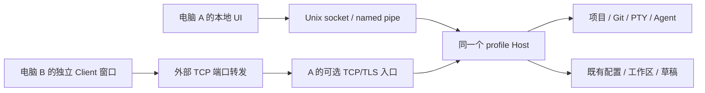
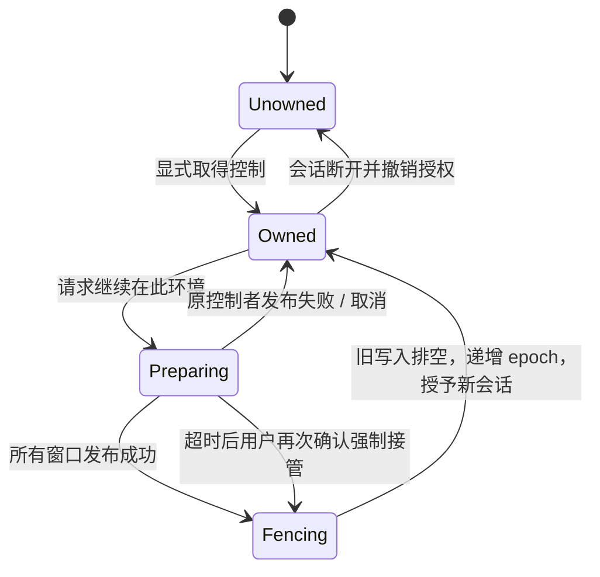

# 桌面既有 Host 远程访问设计

- 日期：2026-09-06
- 状态：设计提案；尚未实施，尚未启动 reviewer。
- 实施计划：[desktop-host-remote-access-plan](2026-09-06-desktop-host-remote-access-plan.md)
- 文档工作树：`.worktrees/desktop-remote-access-design`，分支 `plan/desktop-remote-access`。
- 研究基线：`2da693a` 加 `.worktrees/remote-workspaces` 中尚未提交的远端实现。该源码工作树目前包含独立 Server、SSH 部署、远端 Client 和工作区持久化；本文件所在的文档分支不包含那些未提交源码。实施前必须带入真实实现，不能把文档分支当作完整功能基线。

## 1. 产品目标与范围

用户在电脑 A 安装并启动 yttt，离开 A 后，在电脑 B 使用自己的 yttt UI，经 UU 等通用 TCP 端口转发工具连接 A，继续操作 A 已有的项目、终端、Agent 和未保存文档。A 不需要另外安装或部署 Server。

必须成立：

1. 本地 UI 与远程 UI 使用同一个 profile Host、环境身份、配置和资源，不能生成第二份空环境。
2. 桌面远程入口默认关闭；打开入口不重启 Host、不重建 PTY。
3. 本机正常使用仍走 Unix socket / Windows named pipe，不绕行网络入口。
4. 网络可达由外部工具提供；yttt 自己负责认证、加密、权限和会话恢复。
5. 保留独立 `yttt-server` 及 SSH 部署能力，两种部署复用同一个 Host 内核和 Client 恢复流程。
6. 工作区交接不假装同步成功，不丢弃未确认草稿，不因旧请求迟到而覆盖新控制者的修改。

不在本次范围内：UU SDK、自建 Relay、NAT 穿透、云账号、移动端、浏览器、CRDT、多人同时编辑、跨设备离线自动合并、项目级不可信 shell 沙箱，以及改变桌面退出或登录自启政策。

## 2. 方案选择

| 方案 | 结论 |
|---|---|
| 原样 TCP→Unix 字节桥接 | 传输可行，适合隔离探针；不能直接作为正式安全边界。会把本地信任与凭据带到网络，还多一次本地转发。 |
| 现有 Host 内置可开关的 TCP/TLS listener | **采用。** 本地和网络入口进入同一个连接处理器，入口携带由服务端产生的认证上下文。无新 daemon、无额外 Server 部署。 |
| 连接时总是 SSH 部署 Server | 保留为独立部署模式，不用于“连接已有 yttt”。 |



独立部署中的 `yttt-server` 只是另一种 Host 启动器，不是另一套业务服务器。纯 TCP 转发必须允许多个并发字节流连接到同一目标端口；yttt 不要求转发工具理解 HTTP、SSH 或协议内容，也不假设其提供端到端加密。

## 3. 现有代码证据与缺口

以下均指研究源码工作树中的现状，不是已完成的本设计功能。

| 区域 | 已有契约 | 本次需要改变 |
|---|---|---|
| `crates/yttt-transport/src/stream.rs` | `TransportListener` / `TransportConnector` 使用 `AsyncRead + AsyncWrite` | 增加网络传输与可信入口上下文；不能只返回没有来源信息的流。 |
| `crates/yttt-host/src/lib.rs::run` | 单 profile 单 Host，统一资源与连接处理 | 动态管理第二个 listener，共享原有 Host 状态和生命周期。 |
| `crates/yttt-transport/src/auth.rs` | 随机 nonce + HMAC 双向认证；当前 transcript 没有绑定全部通道/权限字段 | 加密网络流量，认证中绑定完整安全字段，服务端决定有效权限。 |
| `authorize_local_capability` / `serve_connection` | capability 检查目前允许所有本地请求；`can_force_stop` 来自握手字段 | 真实区分本机管理入口与远程工作入口，不能接受客户端自报管理员身份。 |
| `src/remote_host.rs::connect` | SSH 认证、部署/发现、Client 连接和恢复混合在一起 | 拆开 Host 发现方式与共享 Client 会话初始化。 |
| `src/ui/workbench/persistence.rs` | 只有 `runtime.is_remote()` 才启动工作区持久化 | 本机窗口也必须发布状态；不能从空 Host 快照清空本机工作区。 |
| `WorkspaceService::new` / `AppProfile::production` | 新增远端配置在 `state_root/config`；桌面配置在原 profile config 根 | 引入明确的 `config_root`，桌面共享原目录；独立 Server 保持自己的目录。 |
| `src/config/storage.rs` | 存在进程级远端绑定；本机路径仍可直接写文件 | 共享环境写入统一走 Host；设备管理数据必须与环境文件分离。 |
| `src/ui/app/mod.rs` | 一个桌面 runtime 对应多个工作窗口，已有弱引用窗口集合 | 设置一个桌面会话协调者，聚合所有窗口的冻结、发布与恢复。 |
| `RemoteAccessSettings` | 只有登录自启授权标记 | 不把该标记误当成网络监听授权。 |
| `HostLifecycle::desktop_owner_disconnected` | 最后一个 DesktopOwner 断开会 force-stop DesktopOwned Host | 远程访问不能偷偷修改该语义；修正文档中与代码矛盾的 Quit Desktop 描述。 |

此前的隔离 TCP→Unix 探针通过了四条并发连接、分片二进制请求、双向响应和半关闭。它只证明流传输兼容性，不证明 TLS、yttt 网络握手或共享工作区已经实现。

## 4. 身份、工作区和控制粒度

### 4.1 稳定身份

- `EnvironmentId`：Host 所属 profile 的持久身份，沿用已有 `environment-id`；不由 IP、端口或窗口标题生成。
- `ProfileId`：Host 的配置与资源隔离域。
- `WorkspaceId`：一个逻辑工作窗口的持久 ID。多个窗口分别保存，不合并成一个固定 `default` 快照。
- `AuthenticatedSession`：Host 根据入口、已认证凭据和 Client 实例建立的会话，所有通道属于同一会话。不能拿 wire 的 `actor_device_id` 直接作授权依据。
- `ControlEpoch`：profile 写入控制代次；与 `HostEpoch` 一起进入写入校验。Host 重启后旧上下文一律失效。

地址只用于连接。证书、环境身份和 profile 校验通过后，换端口仍可认出同一环境；同一地址被另一个 Host 占用时必须拒绝，不能自动接受新指纹。

### 4.2 采用 profile 级单控制者

一次显式接管作用于整个 profile，而不是某个终端标签页。理由：现有 Host 权限已是 profile 级，配置和项目文件也可跨窗口共享；局部接管会引入多写入者与同文件跨窗口冲突的新模型。

- 同一个本机桌面进程的多个窗口属于一个控制会话。
- 每个窗口保有独立 WorkspaceId、布局和草稿快照。
- 一个远程 Client 进程可以打开这个环境的多个工作窗口，共用同一个控制会话。
- 同一控制会话不能为同一个 WorkspaceId 创建两个互相独立的编辑发布者；再次打开应聚焦原视图，或打开明确的观察视图。
- B 可以先选择工作区；开始写入前提示“接管此环境，会使 A 的所有工作区转为观察状态”。

观察者可看已提交布局、文件内容和终端输出；不能写文件/配置/草稿、输入终端、改变 PTY 尺寸、运行新命令或终止任务。观察者的滚动、选择和临时窗口尺寸不写回共享状态。终端尺寸仍由唯一输入租约拥有者决定。

这不是多人实时协作：观察者的编辑器跟随已提交版本，不同步每次按键或尚未持久化的内容。

## 5. 状态与配置归属

| 数据 | 权威与读写路径 |
|---|---|
| 项目、文件、Git、PTY、Agent hooks/history | A 的 Host；B 不探测自己的同名路径或进程。 |
| 环境设置、主题、快捷键、默认/个人布局、项目 `.yttt` | A 既有 profile config / 项目根；本地和远程 Client 的共享写入均经过 Host。 |
| 工作区索引、布局、活动项、树状态、编辑器视图、草稿 | A 的 Host 持久状态；控制者发布，观察者消费。 |
| A 的监听策略、远程访问凭据、TLS 私钥、登录自启授权 | A 的设备管理域；不能通过普通共享配置 RPC 读写或枚举。 |
| B 保存的连接地址、信任证书、凭据引用 | B 的设备配置/OS keychain；是明确的连接元数据，不是工作区文件副本。 |
| 剪贴板、系统权限申请、应用更新、输入法 | 当前 Client 设备；不转成 A 的操作。 |

`HostBootstrap` 增加显式 `config_root`，由启动器传入。桌面模式绑定 `AppProfile.paths.config`，独立 Server 显式传入其原有配置根。`WorkspaceEnvironment` 返回环境描述与配置定位，Client 不再从部署 descriptor 的 `state_root` 猜配置路径。

复用现有存储接口的概念，但删除“只有 remote 才走 Host”的条件：本地/远程连接都能提供 Host-backed 环境存储。Host 不依赖桌面 storage 全局，避免启动递归。共享配置服务按已知环境文档/目录暴露，不提供“任意 profile 子路径下载”；桌面 config 根内的 `state`、`runtime`、凭据和管理文件不得随之暴露。

现有登录自启授权从混合配置迁到设备管理域，保留已授予状态；新网络 `enabled` 必须默认 false。迁移不重写无关设置、不删除 `.gitignore` 项，不把远端 Client 的本机 profile 误当目标 profile。不能依赖 UI 隐藏按钮代替 Host 权限检查。

## 6. 统一持久化与恢复

### 6.1 多窗口初始化

新增 Host `ListWorkspaces` / 工作区注册契约，返回稳定 ID、名称、已提交 revision、最后保存时间和资源摘要。

本机首次接入共享持久化时，先使用既有本机恢复逻辑加载窗口，再为每个逻辑窗口分配/恢复 WorkspaceId，注册和发布当前状态。不得调用目前远端“先清空本地，再恢复远端”的路径。

- 旧本机配置和 UI 状态是首次导入源，不是导入后的第二写入源。
- 只有持久化成功才记录迁移完成；失败保留原文件和内存状态，远程入口不能报告就绪。
- 已有 SSH Server 的单 `default` 工作区导入索引并保持原 ID/终端引用，不另建空工作区覆盖它。
- 关闭窗口是 detach，不等于删除持久工作区。关闭项目等显式资源操作仍遵循原有确认语义。
- ProjectId、TerminalSessionId 引用从 Host / 已存布局恢复；不能因 B 的窗口或地址不同重新计算、重新 spawn。
- 项目注册归 Host 工作区引用管理。观察者恢复不能用 `Register/Close` 争抢注册 epoch；视图 detach 不能删除其他窗口仍引用的项目。

### 6.2 草稿正文与布局分开提交

当前恢复 JSON 内联文档正文，1 MiB 快照上限不足以覆盖允许编辑的 6 MiB 文件。本次不能继续把“大文件可编辑，但无提示无法交接”当作成功路径。

采用已有 `DraftBase` / revision 概念，演进为“草稿对象 + 快照引用”：

1. 控制者对变化的脏文档发送 `PutDraft`：稳定 DocumentId、操作 ID、base fingerprint、文档代次、UTF-8 正文。
2. Host 校验控制 epoch、大小和源路径，持久化正文后返回 DraftRef（含内容摘要/版本）。
3. `CommitWorkspace` 用 CAS 原子提交布局元数据、活动项和 DraftRef 集合。Host 必须确认所有引用已持久化且属于当前 profile/文档。
4. UI 只有在该 manifest 被确认后才显示工作区已同步。仅正文上传成功不代表布局与草稿组合已经发布。
5. Manifest 之前崩溃只会留下未引用正文，不改变已发布快照；之后崩溃仍能完整恢复引用的正文。

明确资源边界：布局 manifest 沿用 1 MiB；单份草稿正文不超过现有 6 MiB 编辑文件上限；每工作区引用的草稿总量最多 64 MiB，工作区数量沿用 128。超限返回 `ResourceLimit`，保留编辑内容并阻止无损交接。单草稿请求编码必须小于现有 8 MiB 帧上限；不增加通用分块上传协议。

正文只有变化时上传，后台去抖；只读窗口不重复生成正文。未引用对象采用安全的延迟回收，不能删除正在提交或被旧/新 manifest 引用的数据。工作区 revision、操作日志与 manifest 的成功响应仍以文件/目录持久化完成为前提。

Host 重启后恢复索引、布局和草稿，但控制所有者不复活；未存活的 PTY 标为 Exited，显式启动才创建新进程。草稿 base 与当前磁盘不符时显示冲突，不自动覆盖。

## 7. 接管状态机与写入屏障



### 7.1 正常、无人值守交接

1. B 认证后先观察，明确点击“在此设备继续”，提交带 transfer ID 的请求。
2. Host 通知 A 的桌面会话协调者；不要求 A 前有人点击批准，凭据已代表授权。
3. 协调者冻结该 profile 全部窗口的共享编辑/输入，完成已有可提交编辑，聚合所有在途配置写入与工作区发布。
4. 全部成功后，A 返回 Ready，携带 Host 已确认的各工作区 revision。Host 自己核验，不能信任 Client 口头声明已保存。
5. Host 获取写入屏障，排空之前已获准的变更，递增 ControlEpoch、撤销原 terminal input/resize 租约并授予 B。
6. B 根据交接 revision 恢复，重新附着原终端并取得新租约；没有 spawn、没有重跑 Agent。

等待 A 的 Ready 时不能持有阻止 A 提交的写锁。A 的确认默认等待 5 秒；超时只进入“需要确认强制接管”，不自动转移权限。

### 7.2 异常与强制路径

- 发布失败：保持 A 为控制者，解除冻结并显示具体失败，B 不获得编辑权。
- 原会话已断开/卡死：B 再次明确确认“仅恢复最后已保存状态”才可强制取得；UI 展示保存时间，不承诺未上传内容已保存。
- 强制接管不能绕过 Host 中已经开始的文件写入屏障。若磁盘 I/O 未完成，保持交接未完成并报告忙碌；不能一边授予新写入者一边让旧写入落盘。
- 旧 Client 重连先查询 owner/epoch，不按旧缓存自动抢回，不重放旧 mutation 队列。未发布编辑留在原视图作为待处理内容，不能自动合并覆盖 Host。
- 本机有明确的收回控制入口；无损收回先走相同发布流程，强制收回同样说明未同步风险。
- 关闭远程访问立即停止新入口并撤销所有远程会话；本机在写入屏障完成后取得控制，或保持 Unowned 等待本机窗口回来。

所有 Host mutating request（含配置、文件、Git 写入、新终端、终止、输入/resize 和草稿）在实际执行处检查已认证会话、HostEpoch、ControlEpoch；检查和提交不能被接管插入。独立终端租约不能越过 profile 控制权。重复操作恢复也必须先鉴权，再查日志；旧 epoch 的重放不能成为绕过入口。

## 8. 网络认证与可信入口

### 8.1 传输

新增 `yttt-transport-tls`，依赖已有版本族 `rustls 0.23` / `tokio-rustls 0.26`；不依赖 GPUI。只支持 TLS 1.3，关闭 early data，不支持明文自动降级。

Host 首次主动启用时生成、持久化专用证书和私钥。连接信息包含公开证书、指纹、固定验证名称、EnvironmentId、ProfileId 和独立远程认证秘密。Client 将导入证书作为该连接的专用信任根，使用标准签名、名称和期限验证；不能使用无条件接受证书的 verifier。

TCP 地址与证书验证名称分离，允许 B 连接转发后的 `127.0.0.1:port` 而仍验证 A 的身份。Client 不发送凭据给证书/环境不符的对端。证书私钥留在 Host；有效性错误或证书更换要求显式重新导入，不能“连不上就信任新证书”。

### 8.2 认证和通道归属

- 保留本地 IPC token，不共享给远程 Client。初版只管理一个 profile 级随机 256-bit TCP 远程访问秘密及 generation，不引入账号/设备 ACL 系统。
- 网络入口在 TLS 内使用共享协议的挑战认证。HostChallenge 在 Client 发送认证响应前携带 EnvironmentId/ProfileId，Client 必须与导入身份比对。握手 schema 显式升级，MAC transcript 绑定所有安全相关协商字段：协议域/版本、构建兼容性、环境/profile、双方身份/nonce、Host epoch、连接通道、终端 ID、权限请求和凭据 generation。
- 可信 `IngressKind` 来自 listener，`AuthenticatedSession` 来自 Host；本地 peer UID/SID 检查继续保留。客户端声明不能制造 Local/管理入口。
- 请求日志、附着关系、控制权和同一 Client 的各通道都绑定已认证会话，不能仅按可伪造的 `actor_device_id` 或未认证 client ID 索引。
- 保持 Control、TerminalInteractive、StateEvents、各 TerminalData 的独立连接。一个转发端口承载多条连接，不合并为会阻塞输入的单流。
- 每条新通道都验证会话和当前凭据 generation；停止入口或重置凭据必须关闭所有远程通道，而不只是 Control。

SSH direct-streamlocal 的连接在 OS 层也表现为同 UID 的本地进程，不能据此把 SSH Client 认作桌面管理员。独立 Server 应提供一个固定为 `RemoteWork` 的私有工作 socket，`ServerDescriptor` 返回工作 socket 与独立工作令牌；本机管理 socket/令牌不交给 GUI Client。SSH 已提供外层加密，不在该工作 socket 上重复包 TLS。CLI 的 status/idle-upgrade 等管理仍走本机管理入口。两种入口属于同一个 Host，不新增进程。

本设计中设置开关与“断开全部”控制 TCP/TLS 入口的全部会话/通道，不关闭独立 Server 的 SSH 工作入口。两个入口的凭据域分离；重置 TCP 访问秘密不会偷偷撤销 SSH 管理或部署凭据。

### 8.3 能力边界和威胁模型

远程工作连接允许读取环境、观察资源、请求接管；成为控制者后才允许工作区变更。TLS 与 SSH 工作入口都拒绝 DesktopOwner、Host stop/restart/force-stop、远程入口设置、凭据导出/重置以及设备登录自启管理。独立 Server 的管理继续通过所在机器的 CLI/本地管理入口完成。

本设计防御未认证网络访问、错误 Host、窃听/篡改、重放、跨入口身份混淆及误操作。**被授权的远程终端等价于登录该 OS 账号，不是不可信用户沙箱。** 它可以执行该账号有权执行的命令；本地管理 RPC 限制不能宣称阻止已获完整 shell 权限的人读取同账号文件或另开本地 IPC。秘密轮换也不能撤销此前已执行的 OS 级操作。

限制：TLS+yttt 握手总超时 5 秒，未认证并发握手最多 16，已认证远程 Client 最多 4、远程流总数最多 256。超过上限拒绝新连接/通道，不挤占本地入口。认证失败采用有界退避，不因所有流都经 loopback 转发而实施永久 IP 封禁。

## 9. 设置、持久化与开关生命周期

### 9.1 配置域

Host 设备管理配置置于其 private state 的 `remote-access` 目录，不进入共享 ConfigStorage 列表。建议配置：

```toml
schema_version = 1
enabled = false
listen_address = "127.0.0.1:43123"
```

43123 是本设计选择的默认端口，可修改。显式支持 IPv4/IPv6 SocketAddr；不自行绑定 `0.0.0.0` 或所有网卡。非 loopback 地址需本机确认风险。端口占用时不能偷偷换端口，避免转发映射失效。

证书/秘密文件与配置分离，权限为当前用户专用；Windows 使用相应 ACL，而不是只检查 Unix mode。普通设置、启动参数、环境变量、日志中不得写入认证秘密。OS keychain 不可用时，Client 可以仅在内存保存；不静默退回明文配置持久化。

### 9.2 运行状态

`Disabled → Starting → Listening → Stopping → Disabled`，并具有带原因的 Error。状态分离三个事实：持久化的 desired 配置、实际 listener 状态、共享工作区是否就绪。

开启流程：确认授权和工作区初始化/当前发布完成 → 准备安全材料 → 绑定 listener 但不接受业务 → 持久化 enabled=true → 打开 admission gate。任一步失败都关闭候选 listener，UI 不显示“已开启”。网络状态改变通过事件推送，GPUI 不同步等待磁盘/TLS/网络请求。

关闭流程：先关闭 admission、取消全部远程连接并撤销控制授权 → 停止 listener → 尝试持久化 enabled=false。正在执行的旧写入按第 7 节排空；未完成时显示 Stopping，不假称所有变更都已结束。

磁盘/权限可能使“永久关闭偏好”无法保存。此时当前入口仍关闭，UI 明确显示“本次已关闭，但偏好保存失败；重启可能使用原启用配置”，不报告持久关闭成功。不能在无法写磁盘的情况下承诺重启后仍记得关闭。重置凭据只有新 generation 持久化成功才宣布成功；失败时保持当前网络入口关闭并报告风险。

修改监听地址采取先关闭旧入口，再启用新地址；已有远程连接会断开，必须在本机确认。监听句柄、连接注册表和关闭逻辑均由 Host 持有，不归设置窗口或 GPUI view 生命周期。

### 9.3 与应用生命周期的关系

- 关闭 A 的工作窗口、保留桌面托盘：Host、入口、任务保持；窗口关闭前正常发布。
- B 关闭最后窗口/退出/转发断线：只断开 B，A 的任务继续。
- A 显式退出 DesktopOwned 桌面：保持当前停止 Host 的行为；若存在远程连接，增加明确的退出后果确认，不能静默断掉远程办公。
- 已经是 Independent 的 Host：继续按独立生命周期运行。
- 开关不执行 Host lifetime 替换、不注册登录自启、不改变 OS 睡眠策略。未来若需要“退出桌面后继续驻留”，必须单独设计授权，不混进这次开关。
- 重启 Host 时按最后成功保存的 enabled 配置恢复监听；工作区 migration/安全材料无效时 fail closed。旧控制权和 PTY 不复活。

## 10. 用户界面与连接流程

### A：设置 → 远程访问此电脑

只允许本机管理入口操作，复用现有 `yttt-ui` 设置行、按钮和对话框，不直接引入第二套组件样式。

```text
远程访问此电脑                         [关闭]
监听地址                              127.0.0.1:43123
状态                                  未监听
说明                                  将此 TCP 端口转发到其他电脑
连接信息                              [生成并复制]
访问凭据                              [重置并断开远程连接]
当前连接 / 控制者                     设备标签、会话状态
                                      [收回控制] [断开全部远程连接]
```

复制连接信息必须主动操作并提示其中含访问秘密；不自动写剪贴板，也不承诺能在用户跨设备粘贴前自动清除。关闭开关不会终止终端任务。

### B：连接已有 yttt

独立于“SSH Server 部署”：输入转发地址，粘贴连接信息，可选择记住凭据。信息文本使用有界解析（不超过 8 KiB）；复用 `RemoteLaunch` 现有 128 KiB 私有 stdin 启动通道，不把秘密放到 argv/环境变量/deep-link URL。

流程：TLS 与 Host 身份校验 → 挑战认证 → 获得真实环境描述 → 列出工作区 → 观察或显式接管 → 使用公共的恢复流程。

远程 Client 继续用独立进程，避免 B 的本地 UI 与 A 的环境存储全局混用。`RemoteLaunch` 改成明确的目标枚举：`ExistingHost` 或 `SshServer`。连接地址、证书和凭据引用放在 B 的连接记录中；SSH 路径引用已有 SSH connection ID，不复制维护第二份 SSH 凭据模型。

标题栏显示“A 的设备标签 / profile / 工作区”，附加远程和观察/控制状态；不把转发地址 `localhost` 当成环境身份。证书失败、凭据失败、版本不兼容、Host 未就绪、工作区不存在、控制冲突分别提示，不能自动改走 SSH 部署、启动本地 Host 或清空配置。

## 11. 协议及模块变更边界

以下名称为本设计的新契约，不代表源码已有：

| 契约 | 必须承载的语义 |
|---|---|
| `EnvironmentDescriptor` | 环境身份、profile、平台/home/shell、真实配置定位、共享就绪状态、能力/版本。 |
| `AuthenticatedSession` / `IngressKind` | 不可由请求伪造的入口来源、认证主体、Client 会话、凭据 generation。 |
| `RemoteAccessRequest/Status` | 本机管理的读取、开关/改地址、生成/重置秘密、断开连接；desired 与 effective 状态分离。 |
| `ListWorkspaces/RegisterWorkspace` | 多窗口稳定索引、迁移就绪、revision/时间；不硬编码唯一 default。 |
| `ControlContext` | HostEpoch + ControlEpoch + 已认证会话绑定，覆盖所有变更通道。 |
| `Request/Prepare/Ready/Complete/CancelTransfer` | 唯一 transfer ID、旧/新会话、已持久化 revision 集合、无损/强制结果。 |
| `PutDraft/GetDraft/CommitWorkspace` | 独立正文持久化，原子 manifest 引用，幂等/CAS 与有界大小。 |
| 状态事件 | 入口状态、工作区 revision、控制代次、撤销/交接结果；重连仍以查询快照为准。 |

复用 typed `ProtocolFailure` / `FailureCode`，区分权限、冲突、超限、不兼容和 I/O 错误；Client 不靠匹配英文错误字符串判断交接结果。

当前 resource 协议为 6、lifecycle 为 2、帧上限 8 MiB。资源与握手契约必须显式升级，更新所有调用方/测试及构建兼容性；不为旧 schema 留隐式降级。已有本地 idle/busy 升级保护保留。ExistingHost 模式遇版本不兼容只报告双方版本和本机处理指引，不 remotely deploy/replace Host。

本次主要区域：`yttt-transport` / 新 `yttt-transport-tls`、`yttt-protocol`、`yttt-host`、`host_launcher`、`host_runtime`、`remote_host/remote_launch/remote_storage`、`config`、`ui/app`、`ui/workbench/persistence/settings`、`yttt-server` 启动参数和打包。

## 12. 兼容与故障约束

- 引入 config_root 不移动独立 Server 的已有配置；桌面也不复制一份配置到 state/config。
- 本机工作区导入可重试且幂等；原记录不被空快照覆盖。多窗口发布一处失败不能宣布整个环境交接成功。
- SSH Server 仍可部署、连接、关闭 Client 保活及重启恢复；它与 ExistingHost 共用后半段逻辑，不能各修一套。
- 授权入口、配置存储和共享协调代码不得仅依据 `is_remote` 作总开关；连接方式、环境归属、管理权限和持久化能力分别表达。
- 远端读不到文件不应尝试读取 Client 本机同路径。Host Agent 不应由 Client 的进程扫描误判为退出。
- 不要求生产 socket 被真实远程访问测试打开；所有自动/本机 smoke 使用独立 profile、端口、凭据和工作树。

## 13. 验收矩阵

下面 ID 与实施计划一一追踪。实现阶段需要真实行为证据；此文没有把任何一项标成已通过。

| ID | 场景与可观察结果 |
|---|---|
| AC01 | 桌面从未启用网络访问时不创建远程 listener/秘密，不可从网络握手；本地项目、终端照常可用。 |
| AC02 | 运行中启用，Host PID/epoch 与已有终端身份不变；端口占用失败不重启/另起 Host，不改用随机端口。 |
| AC03 | B 经通用 TCP 转发连接到 A 既有 profile；没有 SSH 认证、Server 下载/部署、新空环境。 |
| AC04 | 错误证书、错误秘密、明文、篡改权限/通道字段、被重放认证均被拒绝；公开连接中不可见正文或秘密。 |
| AC05 | 远程请求伪装 Local、DesktopOwner、Host 管理或设备配置均被协议拒绝；会话间通道/日志不能混用。 |
| AC06 | A 两个窗口分别有分屏、文件标签、不同活动项和草稿；B 可按 ID 恢复，不合并、丢窗口或重建终端。 |
| AC07 | A/B 使用 A 的原配置、项目 `.yttt` 与 Agent 环境；B 的工作区/项目文件不被写入。仅明确保存连接元数据可写 B。 |
| AC08 | 无人值守的正常交接自动聚合所有窗口发布；B 只有在完整确认和写入屏障后获得控制。 |
| AC09 | 任一窗口草稿/配置落盘失败、文档超限，正常交接失败；原视图保留编辑内容，不显示已同步。 |
| AC10 | 原 Client 卡死/断网后不自动抢占；明确强制接管仅恢复已确认版本；旧 Client 回来不覆盖新状态。 |
| AC11 | 接管时注入在途写入和旧请求重放；新 epoch 授予后旧输入、resize、文件/配置/草稿变更无效。 |
| AC12 | 观察者可读取终端/文档但不能输入、resize、spawn/terminate、写配置；观察操作不抢项目注册 epoch。 |
| AC13 | B 退出、转发断开、慢读取时，A 的长任务和 Agent 存活；其他连接及本机输入不被慢远程流阻塞。 |
| AC14 | 关闭入口/重置 TCP 秘密覆盖该入口全部远程通道，不能继续发旧输入；A 本地与任务不停止，旧凭据不能重连；不连带关闭独立 SSH 工作入口。 |
| AC15 | 关闭/重置偏好写入失败，实际网络保持关闭，并明确报告未持久化风险，不声称永久生效。 |
| AC16 | A 关闭窗口留托盘仍可访问；显式退出 DesktopOwned 桌面有后果确认；开关不改变 Independent/登录自启。 |
| AC17 | Host 重启恢复工作区/草稿和有效配置，拒绝旧 epoch；失去的 PTY 为 Exited，不自动重跑任务。 |
| AC18 | 6 MiB 合法草稿可传输；正文确认前、正文后 manifest 前、manifest 后分别崩溃，恢复均无半提交引用。 |
| AC19 | 本机/旧单 default 工作区迁移可重复执行且不覆盖有效新状态；来源文件和 Server 原配置保留。 |
| AC20 | SSH 独立 Server 的部署、恢复、Client 退出保活和 busy 升级保护仍成立；ExistingHost 不擅自升级目标。 |
| AC21 | macOS/Linux 的本地 Unix socket 与 Windows named pipe 都保留；安装桌面即可开 TCP 入口，不要求独立 Server。 |
| AC22 | 设置开关、错误提示、连接表单、工作区选择和控制标识在实际 GPUI 窗口验证；失败响应不被乐观成功 UI 掩盖。 |
| AC23 | 换转发地址仍识别同一 Host；同地址换环境拒绝；限流/连接上限失败不拖垮本地 IPC。 |

## 14. 参考与交付边界

- 项目现有 `docs/host-client-architecture.md`、`docs/p2p-relay-architecture.md`、Host 加固计划作为资源所有权与多连接分流依据；历史文字与当前代码冲突时以代码事实为研究基线，并在实现后同步文档。
- [rustls 0.23.41 ConfigBuilder](https://docs.rs/rustls/0.23.41/rustls/struct.ConfigBuilder.html)：TLS 版本选择、专用 RootCertStore、证书配置。
- [rustls 0.23.41 ClientConfig](https://docs.rs/rustls/0.23.41/rustls/struct.ClientConfig.html)：配置复用与安全默认值。

后续执行按实施计划在主会话内完成；不把计划执行委托给 subagent。当前仅交付设计/计划。是否启动独立 reviewer 由用户选择，不自动启动。
