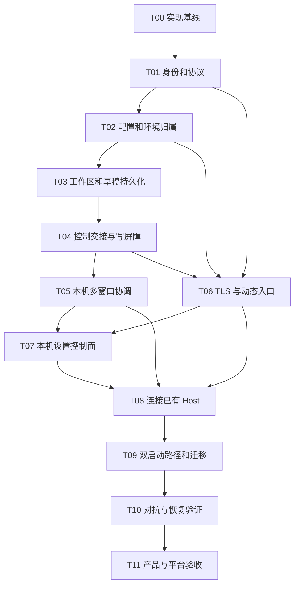

# 桌面既有 Host 远程访问实施计划

> **For agentic workers:** 遵循仓库工作树规则；在主会话内执行本计划，不把计划执行委托给 subagent。用户已批准开始实现；本次未启动 reviewer。本文件同时记录实施进度和未完成验收，不把构建通过等同产品完成。

- 日期：2026-09-06
- 状态：源码实现及本机 Host/TLS/SSH smoke 已落地；真实 GPUI 表面、Linux/Windows 和部分故障验收仍未完成，不能宣布 AC01–AC23 全部通过。
- 设计依据：[桌面既有 Host 远程访问设计](2026-09-06-desktop-host-remote-access-design.md)。协议、权限、资源上限、异常与退出语义以该设计为准。
- 目标：电脑 B 经端口转发连接电脑 A 桌面已运行的 Host，恢复同一环境；不部署第二个 Server。保留独立 `yttt-server` 路径。
- 实现基线依赖：`.worktrees/remote-workspaces` 中未提交的实现。文档分支 `plan/desktop-remote-access` 从 `2da693a` 创建，未包含这些源码，不能直接把该文档分支当作完整功能实现基线。
- 实施工作树：`.worktrees/desktop-remote-access`，分支 `feat/desktop-remote-access`。带入原未提交实现后只修改该工作树，未提交或合并，未改写来源工作树。
- LSP：当前 Rust 1.96 工具链没有可运行的 rust-analyzer；以精确引用搜索和全目标编译迁移调用方。

## 执行与验证原则

1. 执行前为实现创建专属 `.worktrees` 工作树；后续命令、编辑都在该工作树。源码/构建产物/测试 profile 不写主 checkout。
2. T00–T11 在主会话内顺序推进。下列依赖图是数据/接口依赖，不是委托执行授权。
3. 新增符号前确认现有接缝；修改导出 API 前用可用 LSP 查 references。若 rust-analyzer 仍不可运行，记录原因并以精准搜索列全调用方，不猜测遗漏。
4. 新协议一旦切换即迁移所有 Host、Client、启动器和测试调用者。不得把旧 `is_remote` 分支、可绕过授权的适配器或旧入口作为长期兼容兜底。
5. 新永久测试只用于真实权限边界、竞态、持久化/恢复等不确定行为；修复已有回归测试。单纯转发/默认字段不另加永久测试，使用 throwaway smoke。
6. 任务内运行相关的定向测试/实际场景；集成稳定后统一格式化、构建和完整相关回归，不在每项重复全项目 lint/test。
7. GPUI 改动必须用实际桌面验证。服务、转发器、CLI 交互使用受管进程工具；生产凭据、生产 profile 和用户正在使用的终端不可作为测试目标。
8. 测试过滤命令执行到 0 项不能作为通过证据。本文中的新测试文件/测试前缀是待新增位置，不声称现在存在。
9. 每个任务的所有步骤和验收完成才勾选任务。阶段完成不等于功能完成，不交付只能连通 socket 的半成品。

## 依赖与边界



贯穿接口：一个 EnvironmentDescriptor；一个 Host-backed 环境存储；一个 profile 控制会话/epoch；多个稳定 WorkspaceId；本地、TLS、SSH 工作入口共用资源服务但保留不同可信来源。

## T00 — 建立正确实现基线

- [x] T00 完成

**依赖：** 无。

**目标区域：** 工作树、现有远端实现及当前构建入口。此任务不修改功能行为、不提交或丢弃用户源码。

**步骤：**

1. 检查 `remote-workspaces` 的当前状态，区分已有实现和用户后续改动。若已经提交，从包含这些改动的真实提交建立实施工作树。
2. 若仍未提交，将必要的 tracked patch 和新源码文件受控带入新的实施工作树；不复制 `target`、临时 profile、凭据或其他无关文件，不借此自动提交源码。
3. 确认新工作树实际包含 `yttt-server`、`remote_host/remote_launch/remote_storage`、workspace 协议/服务和 GPUI 持久化。比较带入内容的一致性，不凭目录名假定已包含。
4. 在新工作树编译现有桌面和 Server，记录已有错误，不用忽略标记掩盖。

**定向验证：**

```sh
cargo check -p yttt -p yttt-server
```

**完成条件：** 可工作的基线已明确；用户原工作树未被改写；后续所有目标文件确实存在于实施工作树，规划不依赖遗失的未提交源码。

## T01 — 建立可信入口、会话与协议契约

- [x] T01 完成

**依赖：** T00。

**目标区域：** `crates/yttt-transport/src/{stream,auth}.rs`，`crates/yttt-protocol/src/{lib,control,workspace,handshake}.rs`，`crates/yttt-transport-local/src/`，`crates/yttt-client-core/src/`，`crates/yttt-host/src/lib.rs`。

**步骤：**

1. 定义可信 IngressKind / AuthenticatedSession。入口策略由 listener 或绑定上下文传入；本机管理员、TLS 工作入口、SSH 工作 IPC 不由 Client 字段选择。
2. 定义 EnvironmentDescriptor、ControlContext、工作区索引、交接消息、RemoteAccessRequest/Status 和状态事件。复用 typed failure、现有稳定 ID/epoch 与明确大小上限。
3. 升级握手 schema/resource 协议；HostChallenge 在 Client 认证响应前提供可核对的 EnvironmentId/ProfileId，完整 transcript 绑定环境、通道、资源、权限请求、协商版本、双方身份/nonce 和认证凭据 generation。保持业务帧上限，不使用隐式兼容降级。
4. 将 Host 权限判定从 `authorize_local_capability` 的全允许替换为真实入口/会话策略。拒绝远程 DesktopOwner 和 Host/设备管理，保留本地 peer UID/SID 与单实例校验。
5. 把请求日志、附着关系、事件投递及多通道连接归属绑定认证会话；原始 actor 字段只能作受约束元数据，不能决定权限。
6. 同次切换迁移 ClientCore 和全部握手测试/调用方。观察者能力与控制者工作权限分离；不能暂时用“所有会话都是 local”通过编译。

**应保留的行为测试：** 修改握手权限/通道字段失败；不同入口/会话不能共享 journal/terminal attachment；网络工作会话不能声明自己是桌面所有者；版本不兼容在资源请求前明确失败。

**定向验证：** 运行新增的 auth/ingress 定向用例及既有 `yttt-client-core` 的 `transport_contract` 测试；随后运行 `cargo check -p yttt -p yttt-server`，覆盖所有启动者。

**完成条件：** AC04、AC05 的协议边界有反例测试；基础能力不再建立在可伪造的客户端自报标记上。

## T02 — 统一环境配置与设备管理域

- [x] T02 完成

**依赖：** T01。

**目标区域：** `HostBootstrap` / `WorkspaceService`，`src/host_launcher.rs`，`src/host_runtime.rs`，`src/config/{paths,profile,storage,settings}.rs`，其共享配置调用方，`src/remote_storage.rs`，`crates/yttt-server/src/`。

**步骤：**

1. 将 config_root 显式加入 HostBootstrap，更新桌面/Server/测试全部构造点。桌面使用原 `profile.paths.config`，独立 Server 使用原 state/config；环境描述返回真实定位。
2. 统一 Host-backed 环境存储：本地和远程共享配置写入均进入 Host CAS/持久化路径。普通纯配置单元测试可以显式传入临时目录 backend，生产不能因绑定缺失而静默回退本地文件写入。
3. 列清已知共享配置文件/目录范围，阻止经 Config RPC 枚举 runtime/state、设备管理和密钥。解析符号链接/路径越界不能绕过该范围；项目文件功能不因此变成 OS 沙箱。
4. 增加独立的设备 RemoteAccessSettings 持久域，迁移已有登录自启授权且不启用网络。共享 settings 不再携带可覆盖设备管理的字段。
5. 将 I/O 从 GPUI render/同步事件路径移到背景任务，UI 缓存已确认状态。失败返回原错误，不先宣布保存成功。
6. 删除 Client 端从 ServerDescriptor 猜 config_root 的代码，以及共享写入仍直接走 `std::fs` 的生产分支；保留明确的 Client 设备连接元数据写入路径。

**应保留的行为测试：** 本地/远程写同一原配置并受 CAS 保护；B 同名文件不被修改；拒绝读取管理子树和 symlink 逃逸；登录授权迁移不改变 network enabled；原 Server 配置原地保留；保存错误不会更新已确认设置。

**定向验证：** `settings_config` / `layout_config` 相关回归及 Host 配置用例。使用独立 profile 的一次实际设置保存，观察原配置路径和错误状态。

**完成条件：** AC07、AC09、AC19 的配置部分成立。Local UI 不再是绕过控制权的第二个共享写入者。

## T03 — 多工作区索引与可恢复草稿发布

- [x] T03 完成

**依赖：** T02。

**目标区域：** `crates/yttt-host/src/workspace.rs`、`crates/yttt-host/src/project.rs`、workspace wire、`crates/yttt-core/src/model/workspace.rs`、`src/ui/editor/{document,work_area}.rs` 的纯状态结构。

**步骤：**

1. 实现工作区稳定索引、注册、查询和已保存时间，不假定只有一个 `default`。定义首次导入标记，失败时不写完成标记。
2. 将项目注册/引用归属放到 Host：观察者打开现有工作区不执行可覆盖 epoch 的注册，窗口 detach 不关闭其他视图仍引用的项目。
3. 将内联草稿正文改成稳定 DocumentId 的独立持久草稿对象；按设计限制单正文 6 MiB、manifest 1 MiB、每工作区 64 MiB。沿用 fingerprint/base 与 revision 概念。
4. 实现幂等 PutDraft 与引用验证；CAS CommitWorkspace 原子发布 layout + DraftRef。正文、manifest 与操作记录的确认顺序必须可恢复，不能产生已确认但缺正文的状态。
5. 在引用安全前提下回收未引用正文；不在每次布局微调时重写所有文件内容。
6. 补齐旧 default 快照/内联草稿导入；原数据在新 manifest 确认前保留。原资源 ID 不因布局序列化迁移而改变。

**应保留的行为测试：** 两工作区不互相覆盖；重复 PutDraft/Commit 无二次副作用；在正文之前、正文之后 manifest 之前、manifest 之后中断并恢复；6 MiB 最坏编码可通过帧限制；引用不存在/跨 profile 正文被拒绝；冲突 base 保留草稿。

**定向验证：** Host workspace/draft 用例和 editor 纯状态回归。用真实 Host 保存两个工作区、断开 Client、重启 Host 后读取，观察完整内容与 Exited 资源语义。

**完成条件：** AC06、AC17、AC18、AC19 的 Host 存储部分成立；大文件草稿不再偷偷被 1 MiB 内联 JSON 限制排除。

## T04 — 实现 profile 接管与原子写入屏障

- [x] T04 完成

**依赖：** T01、T02、T03。

**目标区域：** Host workspace/control/runtime/terminal 请求处理，`crates/yttt-client-core/src/`，交接协议和状态事件。

**步骤：**

1. 实现 Unowned / Owned / Preparing / Fencing 状态，使用唯一 transfer ID 与 profile ControlEpoch；一个 profile 只有一个可写认证会话。
2. 正常接管先向原控制会话请求发布，不持有会阻止旧控制者提交的写锁；Host 核验全部 Ready revision 后才切换。
3. 实际变更执行处在写入屏障下检查会话/HostEpoch/ControlEpoch，覆盖配置、文件、Git 写入、新建/终止终端、输入/resize 与草稿。权限必须在 journal replay 前验证。
4. 交接排空已获准变更后，递增 epoch 并撤销旧终端租约；新控制者重新 attach，而不是 spawn。长时间 I/O 未完成则不能假称新 owner 已获得控制。
5. 5 秒等待只触发“需要强制确认”状态；显式强制请求才走最后已确认版本路径。发布失败/取消恢复原 owner，不自动抢占。
6. 断线、重连、关闭 TCP 入口和本机收回均使用同一撤销/恢复语义。旧 Client 不能自动恢复控制并发送积压 mutation。

**应保留的行为测试：** 在文件写入执行中穿插 takeover；接管后同一旧操作 ID 重放被拒；旧输入/resize 无效；Prepare 不阻止旧状态落盘；任一 workspace flush 失败拒绝交接；超时不自动授予；观察者 attach 不抢租约/注册。

**定向验证：** Host/client-core 的控制和 terminal 用例；使用两个实际 Client 会话和一个长任务验证接管不改进程身份。慢项目读请求不因新权限锁阻塞本地交互。

**完成条件：** AC08–AC12、AC14 的 Host 控制部分成立；不能用 UI 禁用按钮替代这些保证。

## T05 — 让本机桌面参与共享状态和多窗口交接

- [ ] T05：实现与实际桌面 Host 聚合交接 smoke 已完成；双窗口脏文档、输入法和原 PTY 的可见交互验收阻塞。

**依赖：** T03、T04。

**目标区域：** `src/ui/app/mod.rs`、`src/host_runtime.rs`、`src/ui/workbench/persistence.rs`、`src/ui/workbench/surface.rs::ensure_terminal_pane`、`src/ui/workbench/state/terminal.rs`、`src/ui/workbench/project_files.rs` 及 editor 状态恢复调用方。

**步骤：**

1. 在现有桌面 runtime/弱引用工作窗口集合上建立会话协调者，不为每个窗口额外创建独立 Host 控制会话。
2. 移除本地窗口跳过共享持久化的条件。首次使用既有本机恢复结果进行 Host 导入；不得先套用远端 clear-local 再导入空快照。
3. 每个逻辑窗口持有稳定 WorkspaceId；保存窗口/标签/分屏/活动项/树和文档状态，避免两个活跃编辑发布者使用同一 ID。
4. PrepareTransfer 时冻结全部共享编辑和输入，聚合在途配置与工作区提交，处理尚未完成的输入法编辑；只有全部成功才向 Host Ready，失败恢复本机操作并展示错误。
5. 完成接管后所有本机窗口进入明确观察状态；重连查询 Host owner/epoch，保留未发布编辑但不自动上传覆盖。支持本机显式收回。
6. 观察者与控制者恢复走同一环境/资源描述；按需要 attach 原终端，missing terminal 显示 Exited 并提供显式启动。窗口关闭只 detach，不删除索引。

**应保留的行为测试：** 本机启动不被空远端快照清空；两窗口聚合发布中一处失败不能发送 Ready；重连不隐式回到 Active writer；窗口 detach 不关闭另一视图的资源。

**实际 UI 验证：** 在隔离本机 profile 打开两个工作窗口，各自有脏文档、分屏和不同活动项；观察 Host 中分别保存的状态，再进行一次完整交接与收回。必须确认未保存内容和原 PTY 被保留。

**完成条件：** AC06、AC08–AC12、AC17、AC22 的桌面部分成立；不是仅修改一个 `is_remote` 判断就宣布支持共享。

## T06 — 增加 TLS 传输及动态网络入口

- [x] T06 完成

**依赖：** T01、T02、T04。

**目标区域：** 新 `crates/yttt-transport-tls/`；Host 内新增 `remote_access` 模块；workspace Cargo 配置；本机/Server 启动接缝。

**步骤：**

1. 实现 TLS Connector/Listener，采用锁文件中已有 rustls/tokio-rustls 版本族，只启用 TLS 1.3、禁用 early data。证书生成使用成熟 X.509 库；不手写密码协议或无条件信任 verifier。
2. Host 主动启用时生成专用证书/私钥和独立 TCP 秘密；Client 用导入证书及固定名称标准验证，地址与身份分离。本地 IPC token 不外发。
3. 在同一个 Host 中动态管理 listener/admission gate，不改变 Host epoch/PID，不启用时不创建网络服务或秘密。即使网络握手耗尽限额，本地 accept 仍可继续。
4. 实现设计中的开启事务、关闭顺序、改地址、秘密 generation 轮换和全部 TLS 通道取消；实际状态与持久化 desired 配置分别反馈。
5. 实现 5 秒握手截止、有界并发/连接上限和失败退避；保持独立控制/交互/数据/事件连接，慢远端不能锁住本地服务。
6. 记录已认证远程连接状态供本机 UI 查询/订阅。日志不得输出秘密、TLS 私钥或工作区正文。

**应保留的行为测试：** 无证书信任/错误秘密/明文失败；绑定失败后未启用；开启不中断既有资源；关闭与轮换取消所有通道；写配置失败不宣称永久生效；连接上限不占住本地入口；不同地址上的正确 Host 仍通过身份校验。

**定向验证：** 实际 Host 的 TLS 连接与状态变更 smoke，加对应安全/关闭竞态回归；`cargo tree -p yttt-server --edges normal` 确认新传输没有引入 GUI 依赖。

**完成条件：** AC01–AC05、AC13–AC15、AC23 的传输部分成立；没有另起桥接 daemon 或第二个 Host。

## T07 — 本机设置开关与退出后果确认

- [ ] T07：设置及退出控制面已实现，保存失败回归通过；实际开关/托盘/退出确认操作未验收。

**依赖：** T05、T06。

**目标区域：** `src/ui/workbench/settings.rs`、`src/ui/workbench/settings/view.rs`、`src/ui/workbench/state/settings.rs`、`src/ui/i18n/`、`src/ui/app/mod.rs`、`src/desktop_tray.rs`、设备设置持久化调用方。

**步骤：**

1. 在本机设置加入“远程访问此电脑”：默认关闭、监听地址、effective 状态、说明、复制连接信息、重置凭据和当前控制者/连接。
2. 开启前通过会话协调者确认共享状态就绪；使用已有 yttt-ui 控件与异步请求状态，操作未完成不能显示成功。
3. 非 loopback bind、改地址、重置并断开等破坏连接的动作需要本机明确确认；保存失败按设计区分“本次关闭”与“永久偏好未保存”。
4. 接入“收回控制”“断开全部 TCP 远程会话”；窗口/设置页关闭不能销毁 Host listener。
5. 根据实际 HostLifetime 增加桌面退出后果确认：DesktopOwned 会停 Host，Independent 不受 GUI 退出影响。保持原登录自启开关独立。
6. 远程窗口不显示可操作的 A 设备管理设置，Host 侧已有同样限制；不能只靠隐藏 UI。

**应保留的行为测试：** 启用/保存失败的 UI 不先更新确认状态；远程视图拿不到设备管理动作；退出确认取消不释放 DesktopOwner。

**实际 UI 验证：** 操作开关、端口冲突、非 loopback 警告、保存失败、关闭设置窗、关工作窗留托盘、取消退出和确认退出。观察 Host PID、端口与已有任务，而不只检查按钮值。

**完成条件：** AC01、AC02、AC14–AC16、AC22 的设置表面成立。

## T08 — 连接已有 Host 的独立 Client 流程

- [ ] T08：ExistingHost 真实转发路径通过；连接表单及独立远程窗口的可见交互未验收。

**依赖：** T05、T06、T07。

**目标区域：** `src/remote_launch.rs`、`src/remote_host.rs`、`src/remote_storage.rs`、`src/ui/app/remote_connect.rs`、`src/ui/app/mod.rs`、`crates/yttt-core/src/commands.rs`、`src/ui/workbench/action_handlers.rs`、`src/ui/workbench/palette.rs`、连接记录/OS keychain 代码。

**步骤：**

1. 将 RemoteLaunch 改成 ExistingHost / SshServer 目标枚举；保留 128 KiB 私有 stdin 传递和秘密清理，不增加 argv/env/deep-link 秘密路径。
2. 把 `remote_host::connect` 拆为 Host 发现/认证材料获取与共享 Client 会话初始化；ExistingHost 路径不包含部署和启动目标 Host 的动作。
3. 增加“连接已有 yttt”表单：转发地址 + 有界连接信息 + 可选记住凭据；8 KiB 输入上限，错误证书/环境先拒绝，不发送认证秘密。保存连接元数据与保存工作区明确分离。
4. TLS 认证后获取 EnvironmentDescriptor、ListWorkspaces，先观察，明确显示 profile 级接管范围；正常/强制接管采用同一状态机。
5. 复用独立进程远程 UI 和环境存储绑定，B 本地桌面不能被切换到 A；标题用稳定设备/profile/工作区身份，不把 localhost 当作主机名。
6. 连接错误按 typed 结果展示重试/取消；不能自动退回本地目录、SSH 部署、忽略证书或清空工作区。重试遇控制权变化必须重新选择，不重放旧编辑。

**应保留的行为测试：** Target 路由导致可观察的正确连接路径（实际目标 Host 不运行 SSH/部署服务也可连接）；错误环境拒绝；旧控制者重连不覆盖；私有启动载荷超限/错误输入不启动半初始化 UI。

**实际 UI 验证：** A 启用入口，使用受管 TCP 转发到 B 填写的地址。B 本地保留独立工作窗口，再启动 ExistingHost 远程窗口恢复 A，核对工作区内容和文件归属。

**完成条件：** AC03、AC06–AC08、AC10、AC13、AC22、AC23 的用户入口成立。

## T09 — 独立 Server、SSH 工作入口与迁移收口

- [x] T09 完成；实际运行本机构建的独立 Server 与隔离 OpenSSH，未验证发布资产下载或异机自动部署。

**依赖：** T02、T05、T08。

**目标区域：** `crates/yttt-server/src/`、`src/remote_host.rs`、`src/host_launcher.rs`、Host listener/session policy、`crates/yttt-ssh/src/transport.rs`、旧记录恢复路径。

**步骤：**

1. 独立 Server 为 SSH Client 提供固定 RemoteWork 的私有工作 socket/工作令牌；ServerDescriptor 不再导出本地管理入口。SSH direct-streamlocal 的同 UID 不能被当成管理员证明。
2. CLI status/stop-if-idle/ensure 等管理仍走本机管理 socket；现有 idle/busy 升级保护原样保留。工作 socket 不重复包 TLS，因为 SSH 已加密。
3. 分离 TLS 与 SSH 的凭据/取消域：桌面 TCP 开关不关闭独立 SSH 工作入口；TLS 秘密轮换不修改 SSH 登录凭据。
4. SSH 路径获取 descriptor 后进入 T08 同一个环境绑定/恢复函数，不保留一套远端专用权限或草稿逻辑。
5. 完成本机旧 UI 状态、旧单 default/内联草稿与配置授权的幂等迁移，保持原独立 Server config_root 和运行中资源 ID。失败不得记完成、覆盖原数据或宣布共享就绪。
6. 清除过时调用方、旧 remote-only 业务条件和隐式 schema fallback；保留用户已有 SSH endpoint/recent 记录，不删除 `.gitignore` 项。

**应保留的行为测试：** SSH 工作凭据不能连管理入口；同 UID 的工作 socket 仍拒绝 DesktopOwner；迁移重试不覆盖新快照；旧 Server 配置不移动；关闭 TCP 不影响 SSH 会话。

**实际验证：** 独立部署一次 Server，经 SSH 连接、恢复草稿、Client 退出保活；有运行终端时请求兼容性替换，确认 busy 拒绝。再次验证 ExistingHost 不调用这条部署路径。

**完成条件：** AC05、AC19、AC20 成立；保留 Server 不意味着保留网络/本地权限混淆。

## T10 — 集成对抗、故障与恢复验证

- [ ] T10：权限、fencing、持久化和真实恢复证据已取得；原生 watcher 失败及未覆盖的产品故障场景见下表，不能记整套全绿。

**依赖：** T01–T09。

**目标区域：** 现有 `crates/yttt-client-core/tests/{host_roundtrip,transport_contract}.rs`、Host 模块回归测试；必要时新增 `crates/yttt-client-core/tests/remote_access.rs`，不增加断言源代码/布线的测试。

**步骤：**

1. 将真实 Host + 两个独立 Client + 三类入口组合运行。覆盖权限伪装、握手篡改、错误证书/秘密、旧 credential generation 和旧 control epoch。
2. 注入在途文件写入、丢响应、Prepare 时卡住一个窗口、磁盘/目录权限失败。验证写入屏障、幂等日志和已确认快照，不只验证“返回错误”。
3. 运行正文/manifest 三个崩溃点及 Host 重启，核对 6 MiB 草稿、冲突 base、资源 Exited 与没有重跑进程。
4. 创建慢远端读取与连接/握手上限压力，验证其他 Client 与本地终端输入仍响应。分别关闭/重置，检查 Control/Interactive/StateEvents/Data 全部被撤销。
5. 运行既有相关 suite，修复真正的契约回归。若 macOS 原生 watcher 仍不送事件，使用独立 native watcher 探针区分环境故障，完整记录失败；不得通过新增 ignore、扩大超时或改成轮询来伪造全绿。

**集成命令：**

```sh
cargo test -p yttt-host -p yttt-server -p yttt-client-core -p yttt-core -p yttt-protocol --lib
cargo test -p yttt-client-core --test transport_contract --test host_roundtrip
cargo test -p yttt --lib
cargo test -p yttt --test ui_state --test settings_config --test layout_config --test editor_workspace --test commands_keybindings
```

新增 transport/remote-access 专用用例按实际文件名一并运行。执行者记录每条命令实际通过/失败/忽略数量，不能把隔离重跑与整套全绿混为一谈。

**完成条件：** AC04–AC19、AC23 有行为证据；没有未说明失败、未验证的强制接管分支或偷偷放宽的安全门槛。

## T11 — 产品场景、跨平台与最终交付

- [ ] T11：当前仅有 macOS arm64 执行环境，GPUI 实际表面不可用；Linux/Windows/UU 验收未运行。

**依赖：** T10。

**目标区域：** 实际桌面/Server 构建、现有平台 CI/打包配置、现有 `README.md`、`docs/usage.md`、Host 架构文档和 `CHANGELOG.md`。

**真实产品验收：**

1. A 使用独立 profile，启动桌面、两个工作窗口与长任务。保存配置和草稿；默认端口不可用。
2. 开启后记录同一个 Host PID/epoch/terminal ID；经外部通用 TCP 转发，让 B 的真实 yttt Client 连接。目标 A 不准备 SSH 登录或独立 Server，证明该路径没有隐性部署依赖。
3. B 观察并显式接管，核对全部窗口/草稿、输入权和文件位置。A 收回，再由 B 接管；全过程不重跑长任务。
4. B 断线/退出、A 关闭窗口留托盘、Host 重启、关闭入口、重置秘密、退出桌面分别验证，截图/日志只保留必要证据且不含秘密。
5. 用真实 Agent 进程测试硬终止后状态清理与父 shell 存活，防止环境归属重构重新引入 Client 进程扫描。
6. macOS 与 Linux 验证 Unix socket 本地路径，Windows 验证 named pipe 本地路径；三平台的桌面 Host 均测试 TCP 入口。独立 Server 原支持平台/发布资产保留，不假称新增了其 Windows 部署支持。
7. 有 UU 等实际转发工具的设备时复验同一地址/证书流程；没有时必须明确记录使用的通用 TCP 转发方式，不能声称完成特定第三方工具兼容认证。

**集成收尾：** 在实际 smoke 通过后按仓库规则处理临时程序/凭据/受管进程，并更新上述已有文档：清晰区分 ExistingHost 与 SSH Server；说明 profile 级接管、默认关闭、原配置归属、端口转发方式和 DesktopOwned 的真实退出后果。只在此时统一运行格式化/最终构建，不为文档措辞写永久测试。

```sh
cargo fmt --all
cargo check -p yttt -p yttt-server
cargo build -p yttt -p yttt-server
```

**完成条件：** AC01–AC23 全部逐项记录实际结果与证据；不支持的测试设备/环境缺口必须明确列出，不能标为通过。只有真实桌面流程成立才宣布功能完成，不能以库编译或 TLS 回环代替产品验收。

## 验收追踪

“通过”只覆盖该行已运行场景；“部分”表示完整设计断言仍有明确缺口。协议现为 resource 7、lifecycle 3、desktop-shell 2。

| 验收 ID | 结果 | 实际证据与缺口 |
|---|---|---|
| AC01 | 通过 | 隔离桌面 profile 默认无网络凭据/入口；本地 Host 发布工作区，启用后才生成专用 TLS 材料。 |
| AC02 | 通过 | 实际桌面 Host PID 68090/epoch 1 在开启、转发连接及关闭入口期间不变；transport_contract 覆盖端口占用失败且不改用随机端口。 |
| AC03 | 通过 | ExistingHost 经 Python 通用 TCP 转发 `44322 → 44321` 连接原桌面 Host；连接路径不访问 SSH 或部署 Server。 |
| AC04 | 部分 | TLS 错误证书/环境/秘密、伪造 DesktopOwner、generation 轮换和握手权限篡改有回归；未单独做抓包泄漏检查。 |
| AC05 | 通过 | transport_contract 与本地 transport security 覆盖可信入口、会话 nonce、journal/通道隔离和工作入口拒绝设备管理；真实 SSH smoke 同样拒绝。 |
| AC06 | 部分 | 实际桌面 Host 保存两个独立 WorkspaceId，转发 Client 发布并读取各自不同草稿；未可见操作完整分屏/标签/活动项恢复。 |
| AC07 | 部分 | 转发 Client 修改 A 原配置，B 同名 sentinel 保持不变；Host-backed 主题目录移动/读取/删除已运行。Agent 环境及项目 `.yttt` 完整 UI 操作未逐项验收。 |
| AC08 | 部分 | 真实桌面协调者自动发布两个窗口并完成正常接管，未走 force；尚未可见注入一个 GPUI 窗口卡住。 |
| AC09 | 部分 | 配置 CAS、原子替换失败及设置保存失败保留确认状态/可重试有回归；多窗口交接时保留屏幕上编辑的场景尚未运行。 |
| AC10 | 部分 | 控制状态机验证超时不自动授予、显式 force；旧会话重放被拒绝。断网后旧 GPUI Client 返回的完整交互未验收。 |
| AC11 | 通过 | 真实 Git post-checkout hook 阻塞已准入写入；强制接管等排空后才授予。journal 回归验证旧 context 为 StaleEpoch、新 context 下旧 actor 为 PermissionDenied，终端不重建。 |
| AC12 | 通过 | observer attach 不抢交互租约；非控制者 mutation 被 Host 拒绝；项目多 view 注册/关闭有回归。 |
| AC13 | 部分 | 真实 TLS 关闭后原父 shell/终端保留；SSH Client 退出后原任务保留；慢请求测试因等待 native watcher 事件失败，不能称完整慢连接场景通过。 |
| AC14 | 通过 | transport_contract 轮换/关闭取消含 observer terminal-data 的 TLS 会话，旧秘密失败，本地与 SSH 工作入口仍可用；实际桌面关闭后重新 attach 原终端。 |
| AC15 | 通过 | 将持久化目标变为目录注入失败；effective Disabled、无连接、缓存 enabled 偏好保留并返回错误，不宣称永久关闭。 |
| AC16 | 部分 | 退出逻辑按真实 HostLifetime 确认并先发布；Independent Client 退出保活已实际运行。托盘驻留和取消/确认桌面退出未实点。 |
| AC17 | 部分 | 桌面 Host 重启至 PID 2533/epoch 3，恢复两个草稿且无 Running/Starting 资源，不重跑任务。首次受管重启未就绪、再次重启成功，不能声称无缝重启。 |
| AC18 | 部分 | 6 MiB 正文发布恢复、正文后 manifest 前重启、缺正文拒绝有回归；新增控制帧最坏 JSON 字符往返与部分正文/配额失败恢复测试。文件系统边界模拟不等同每个 fsync 点的进程硬杀。 |
| AC19 | 部分 | legacy inline/default 草稿迁移及重复打开保留 revision/terminal ID 有回归；旧 Server 原 config_root 保留。完整历史本机多窗口数据集尚未产品验收。 |
| AC20 | 部分 | 真实 OpenSSH direct-streamlocal → work.sock；独立 Server PID 78672/epoch 1 跨 Client 退出保留任务/草稿并拒绝 busy stop。发布资产下载/异机自动部署未运行。 |
| AC21 | 阻塞 | macOS arm64 Unix socket/TCP 已运行；只安装 aarch64-apple-darwin target，未配置远程测试主机，Linux/Windows 无实机结果。Server 正常依赖图 746 行，无 GPUI/yttt-ui 依赖。 |
| AC22 | 阻塞 | 实际桌面已启动，但全屏截图均匀黑色、定窗截图失败、无可访问窗口；主线程停在 NSApplication 事件循环。具体显示环境原因未确定，不以纯状态测试替代实际 GPUI 验收。 |
| AC23 | 通过 | 正确证书与身份经不同转发地址成功，错误环境拒绝；4 Client 上限、16 个未完成 TLS 握手压力下，本地 ListResources 在 1 秒内返回。未做 UU 特定工具认证。 |

### 运行记录与限制

- 桌面 smoke：原 Host PID/epoch 不变；两个工作区草稿独立；A 配置改变而 B 配置不变；关闭 TLS 后原终端可重新附着。
- 真实 Agent：隔离 CODEX_HOME 中启动实际 Codex，未发模型请求；硬终止后父 shell 继续输出并存活。此 smoke 只证明进程和父 shell，不声称已验证全部 Agent snapshot 清理。
- SSH smoke：真实隔离 OpenSSH 与独立 Server 完成工作入口连接、任务/草稿恢复、Client 退出保活和 busy stop 拒绝。此前出现过请求超时，之后完整重跑成功；未定位该瞬态超时根因，不声称修复了它。
- 应用回归：lib 161、commands_keybindings 69、editor_workspace 10、layout_config 41、settings_config 31 全通过。ui_state 全套为 224 通过/2 失败；其中项目 palette 测试移除与测试主题无关的默认快捷键假设后单独通过，设置保存失败回归也单独通过。
- 底层回归：Host/Server/ClientCore/core/protocol 的组合 lib 命令共 81 项通过；随后新增的 6 MiB 控制帧和部分正文/超额 manifest 恢复两项分别通过。protocol 全部 suite 37 项通过；transport/local/TLS 共 15 项通过（其中 security 13）；transport_contract 5 项通过。
- Host roundtrip：最终串行运行 20 通过、2 个 watcher 失败、3 个原有忽略。此前并行命令在 300 秒外部期限被停止，另见 file-limit 失败及 Agent snapshot 用例挂起；两者隔离重跑均通过。没有把串行/隔离结果写成并行全绿。
- 生命周期回归：迁移 view_id、profile control 和显式 state/config 参数后，直接运行同一已编译 `process_roles` / `desktop_tray_lifecycle` 二进制分别 7 / 2 项通过，覆盖崩溃恢复、busy 替换保护、DesktopOwned 退出和幂等终端关闭。通过 Cargo 启动时子 Host 曾在 8 秒内未发布任何状态；直接 HostLauncher probe 成功，差异与启动环境有关，根因未确认。
- 原生 watcher：`external_keybindings_edits_reload_without_restart` 未收到变更；Host 的两个 watcher 相关用例也超时。独立 notify RecommendedWatcher 探针同样无事件。没有新增 ignore、扩大超时或改用轮询来伪造通过。
- 临时 smoke 源码、隔离 profile、密钥、截图、通用转发器、SSH 服务及测试桌面/Server 在验证后清理；没有使用生产 profile 或生产凭据。
- 调用方验证：`cargo check --workspace --all-targets` 已通过；补齐 wire_schema、process_roles、desktop_tray_lifecycle 及性能脚本的最新协议/Host 启动参数，不保留旧参数 fallback。
- 收尾：`cargo fmt --all`、`cargo check -p yttt -p yttt-server`、`cargo build -p yttt -p yttt-server` 及性能脚本 `bash -n` 均成功。保留上游 `block 0.1.6` 的 future-incompat 警告，未压制。

## 交付时必须回答

- A 的现有 Host 是否真正被复用，而不是部署/启动了另一实例？
- 本机多个窗口的状态、配置和草稿是否由同一 Host 权威保存？
- 强制接管、磁盘失败、关闭开关和退出应用是否都与设计中的风险提示一致？
- TLS/SSH 工作入口是否都无法通过自报身份获得本机管理权限？
- 哪些真实平台/转发路径已运行，哪些尚未运行？
- 独立 Server 是否仍能使用，是否存在被遗留的旧调用路径？

本次实现已由用户明确批准。尚未完成的实际桌面/平台验收保持未勾选；需要可操作的桌面窗口和 Linux/Windows 测试设备后才能关闭这些项目。

## 2026-09-07 — 启动与远程窗口补充修正

- 专属工作树 `.worktrees/desktop-startup-corrections`，分支 `fix/desktop-startup-corrections`；承接前一实现的未提交改动，未修改来源工作树。
- 引入明确的 Restore / Empty / OpenProjects 窗口意图。远程连接的第一个窗口不再因 `Some([])` 被误判为新建工作区；本机和远程都先采用 Host 的已确认快照，空快照不再被历史项目替换。
- 关闭视图后把 WorkspaceId 归还恢复队列；重新打开恢复原身份，明确新建窗口仍分配新身份。
- 恢复未完成时展示加载态，并阻止 eager 终端/Agent 提前启动。实际隔离桌面运行 Codex `--version`，Host 终端输出 `codex-cli 0.153.4`，退出码 0；未发送模型请求。用户原始 Agent 错误正文未提供，因此这项证明不等于识别了所有 Agent 启动错误的根因。
- 首页增加 Remote services，复用 SSH 连接管理，并提供 TLS Host 连接列表、新建、选择编辑、保存和删除。旧单条 TLS 记录可读取并迁移为多条记录，秘密仍仅存 OS 凭据库。
- 本地/远程及只读/恢复状态移到底部状态栏；移除顶部常驻 Controller/UUID/revision 横幅和把 TLS 错标为 SSH 的项目标题前缀。
- 实际 macOS 窗口已观察到本地项目恢复、空快照首页、底部本地状态；真实 TLS Client 创建独立进程并恢复两个原 WorkspaceId，未新增空工作区，原本地进程保留。此次接管操作包含显式 force，不宣称正常交接故障也已解决。
- 保留行为回归：关闭项目不自动重开、恢复多个历史项目、Agent 启动失败状态清理、首页服务管理不改变本地工作区、TLS 旧记录增加第二个 Host、关闭视图再恢复身份，六项定向测试分别通过。`cargo check --workspace --all-targets` 通过。
- 窗口捕获改用指定进程的真实窗口 ID；全屏截图中的其他应用没有被当作验证证据。远程空环境最后一轮仍停留在连接确认表面，不把它记为实际首页通过；该分支与已运行的本地空快照使用同一恢复实现。
- 临时 Client/桌面/Host、测试配置、连接信息、截图和 smoke 程序在验证后清理。既有 watcher、跨平台及前一阶段未关闭验收不因本次修正而自动标绿。

## 默认布局冷启动写入修复

- 工作树 `.worktrees/default-layout-host-write`，分支 `fix/default-layout-host-write`，承接上一修正的完整改动。
- 根因：默认布局仍在 Client 侧写 `.default-layout.toml.tmp`，该路径不属于 Host 共享配置白名单。删除这套临时文件/sync/rename 路径，统一调用 `config::atomic_write`，正式配置路径由 Host CAS 和原子落盘处理；不放宽权限、不直接绕过 Host 写本地文件。
- 新增独立测试进程中的真实 Host 回归：空配置目录首次生成、保存修改、过期写入拒绝且保留磁盘与已确认 UI 状态、重新读取后重置成功。修改前明确失败于 `PermissionDenied`，修改后通过。
- 定向验证：真实 Host 回归 1 项、默认布局状态失败回归 3 项、layout_config 41 项通过。
- 实际桌面使用全新 profile 启动，没有预写任何布局或设置文件；成功生成 `default-layout.toml`，Host PID 45865/epoch 1 发布 ready，桌面与 Host 日志无错误输出。隔离进程和 profile 随后清理。
- 收尾：`cargo fmt --all`、`cargo check --workspace --all-targets` 和桌面构建通过；生成无开发 fixture 的 `target/dev-app/yttt.app`。旧工作树应用包未覆盖。
